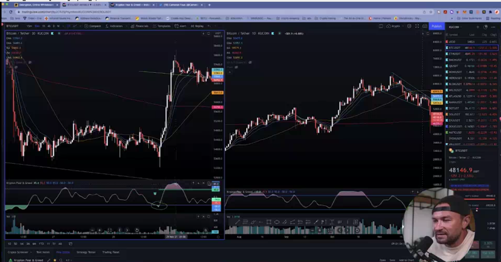

## multiple time frame

* the lower the time frame the less significaant the signal, but potentially earliar sign of a signal.

* the only solution for using time frame is using it with each other. 

* example

* use krypton fear & green for trading in short time frame like 15min and 5min

* note

