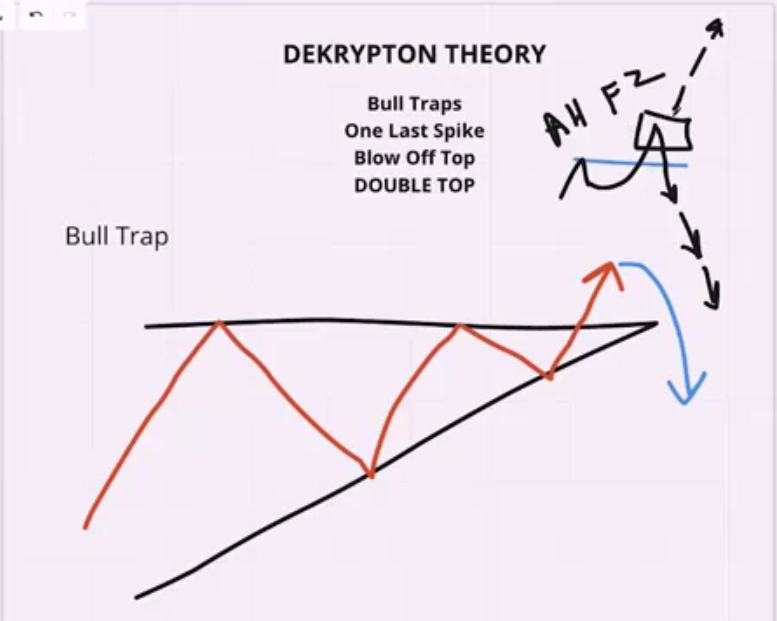
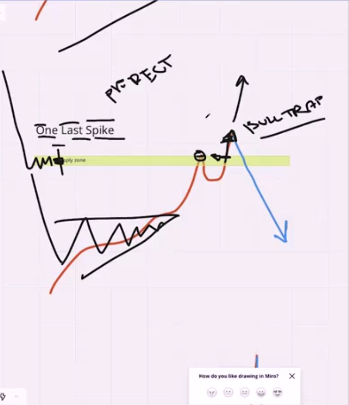
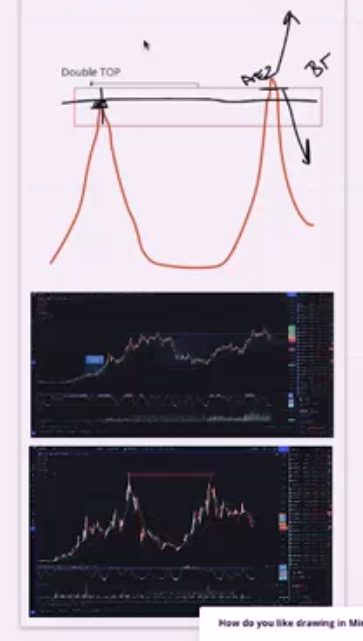
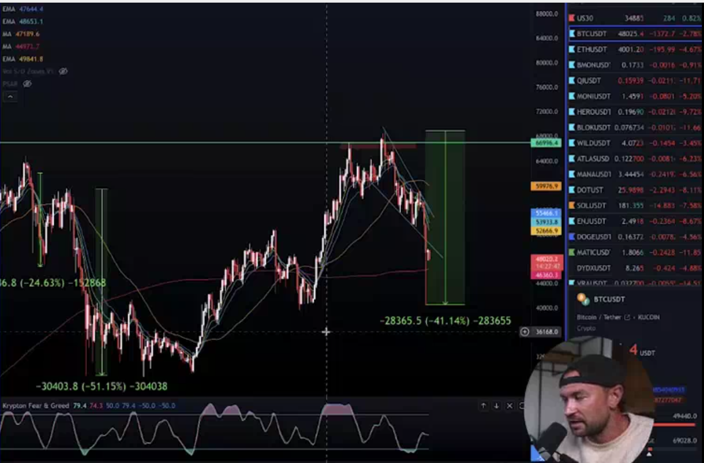
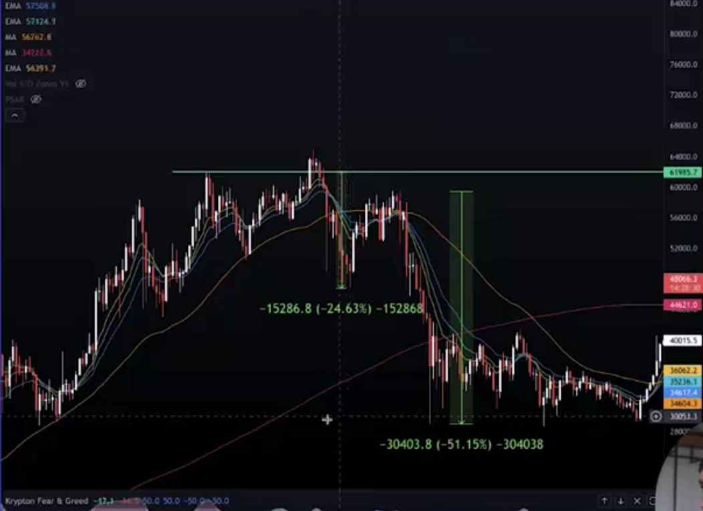
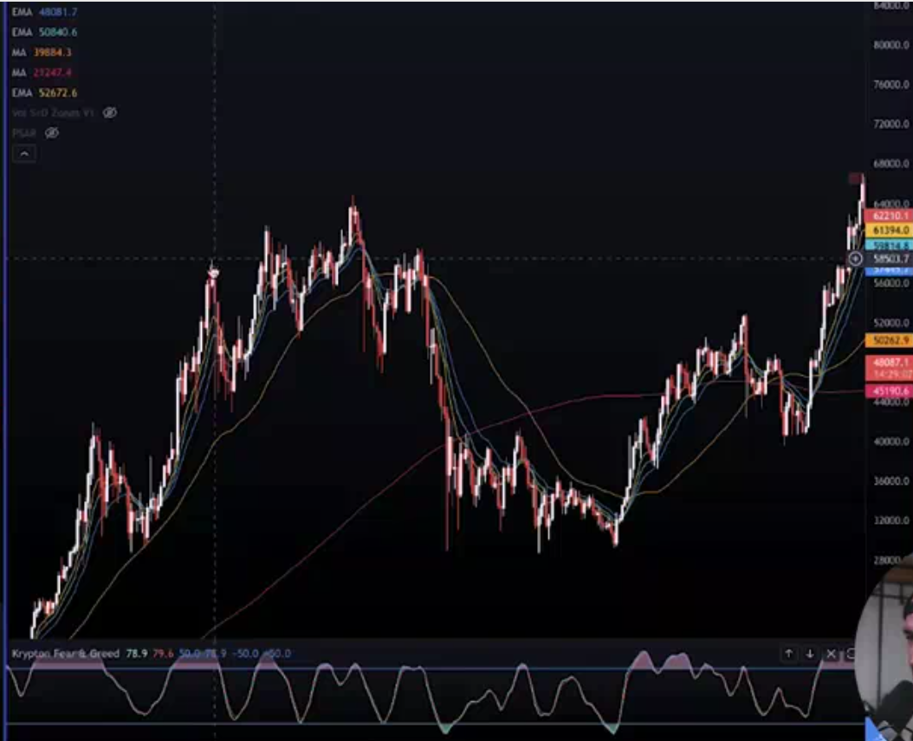
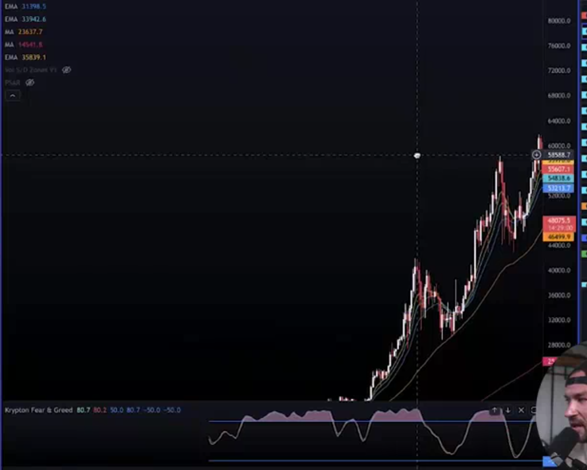
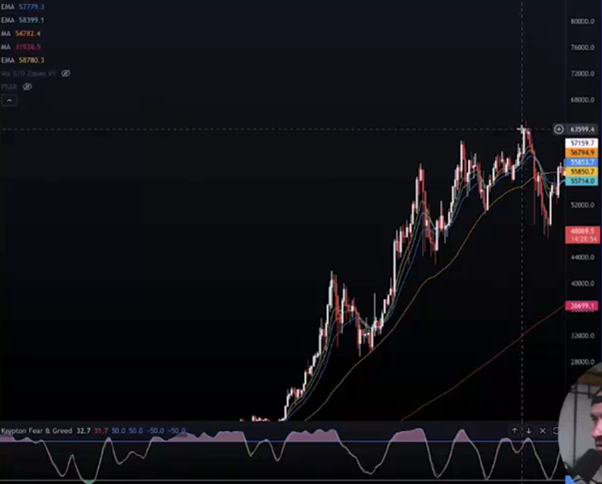

## Bull Trap Reversals Are Potent

* bull trap is something happen in sell also more famouse in buy happen when there is the signal for buy but remember you should have best of your chart for decide where is buy coming or sell and you should also decide base on this experment that you collect it don't do this base on this signal that people take you just use there oponioun if you want this

* some example and trick

* sell happen when there is more volatility in the market or there are more ship in the market buy in the wrong place in that place the sell come very quicly you should be aware in that place and make your position for sell ready

