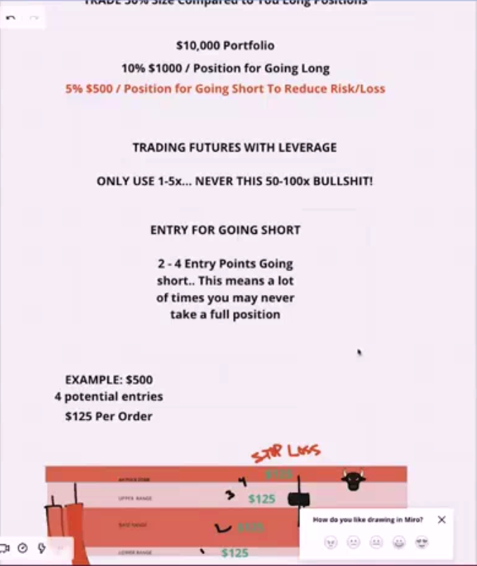
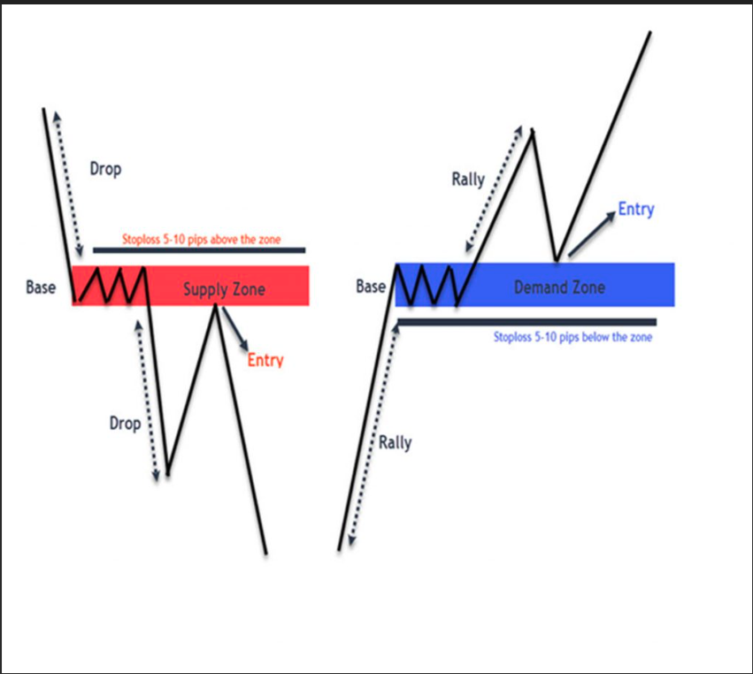
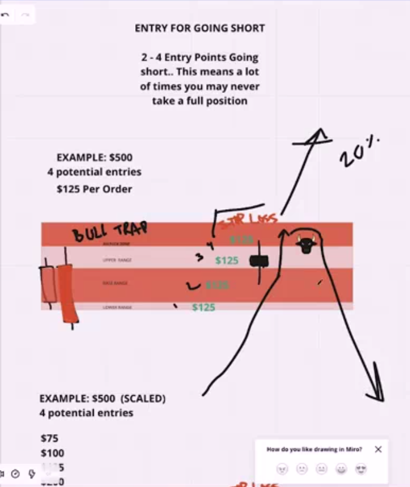
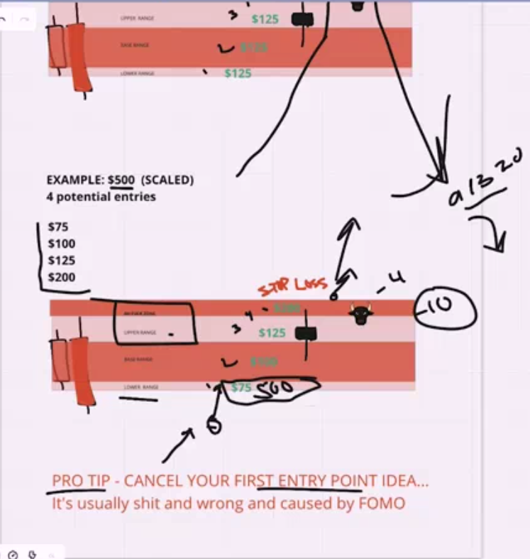

## Risk Management While Getting Short

* shorting in crypto market is more risk than short in bullish market the smaller your position in short market the less risk you take with bearish market in crypto

* don't use a lot of laverage use 1-5x this is less risk and very good when transfer money to wallet less fee you have when transfer money to your wallet

* your take profite in short market should be less than your take profite

* also when market is going down in your profite you can put stop loss in take profit or in market order

* you can also close your position step by step means when you put several order you can close all position step by step not all position in one place

* all this point is matter when you are in the market and try to trade in crypto for short or buy

* in this picture you can see that when market come to supply zone it will take order but not all %5 percent in one place but %1 percent for every part of zone that can be market down on it

* don't take order before supply or demand zone or take on trade in one place this is too much risky to loss your account

