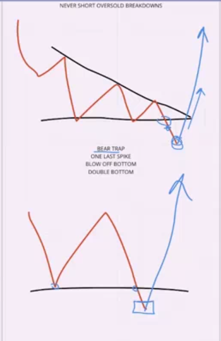
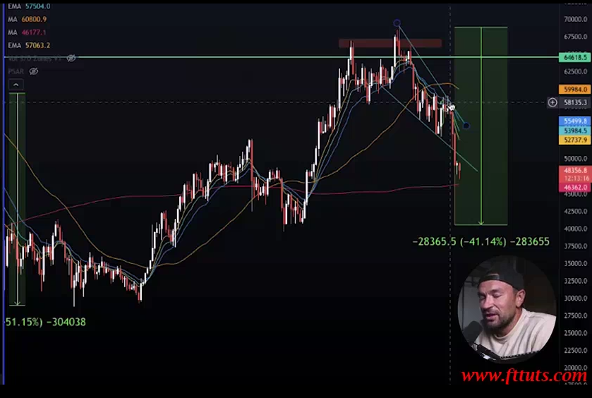
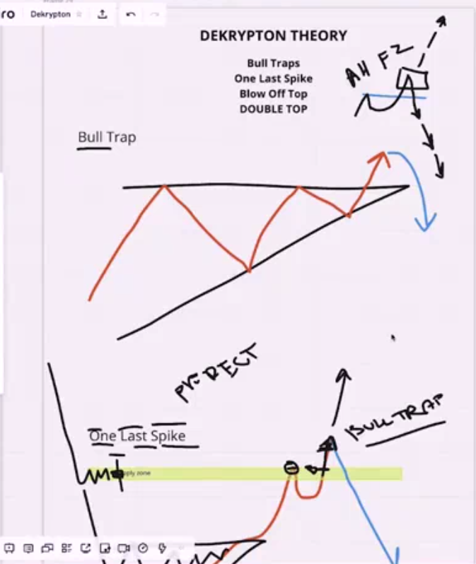
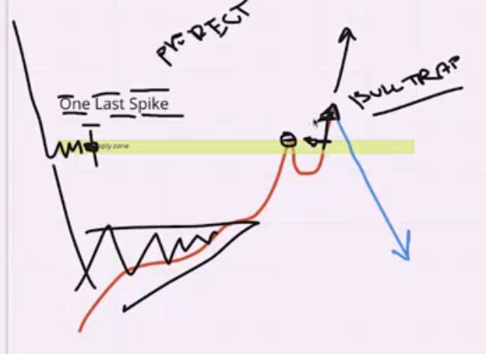
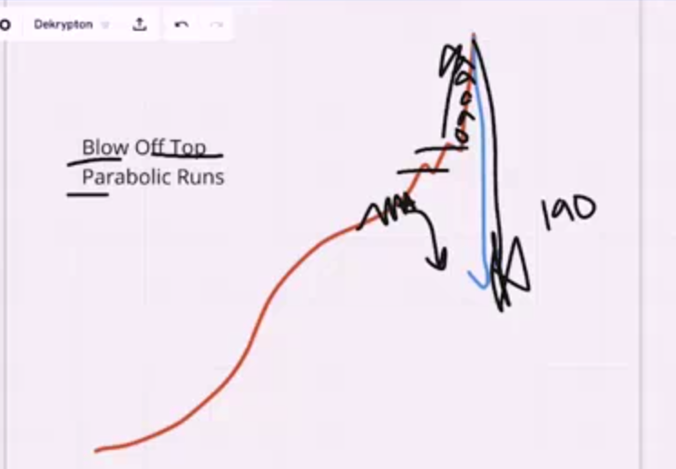
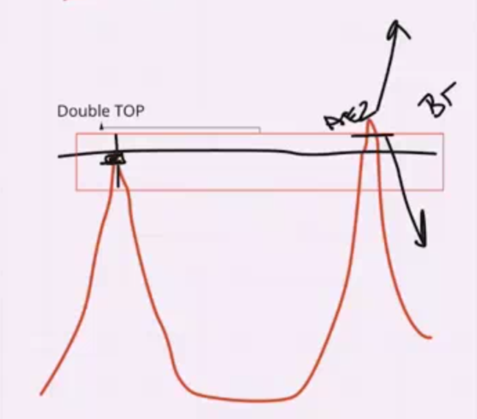
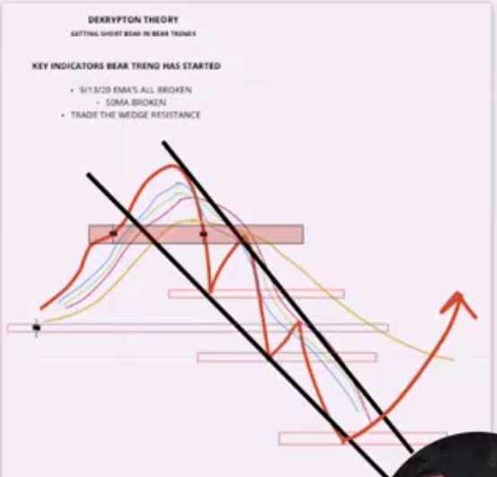

## Never Short Weakness Or Breakdowns

* never short in oversold breakdown this is bad trade or order in that place means you have pattern that indicate for bullish market and you trade in reverse way because in that place you thing that this pattern is reverse in other word it is not happen because bear trape is much possible happen in that  place more than the reverse of this pattern

* example
  

* short for this pattern that bull tracp is possible for this patter ( pattern for bearesh )

