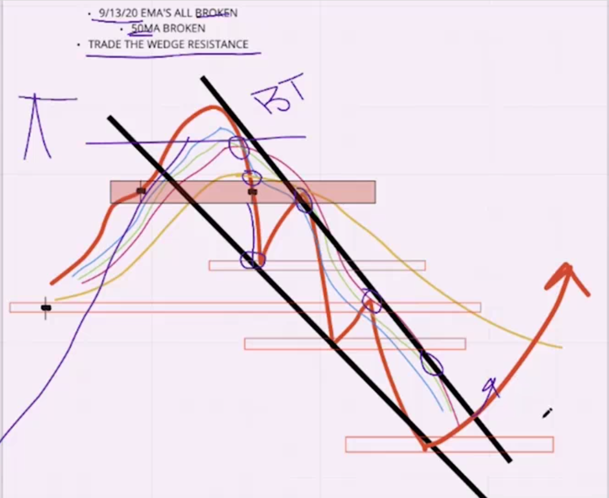
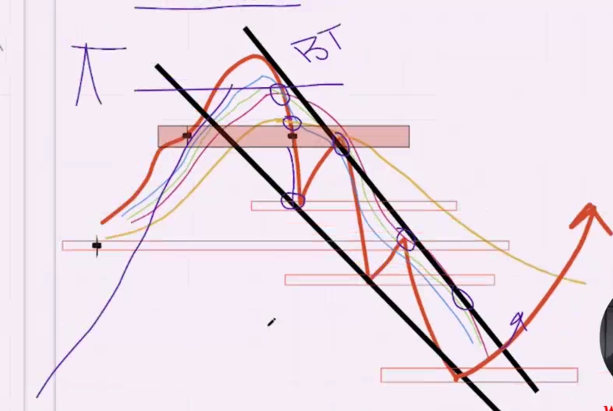
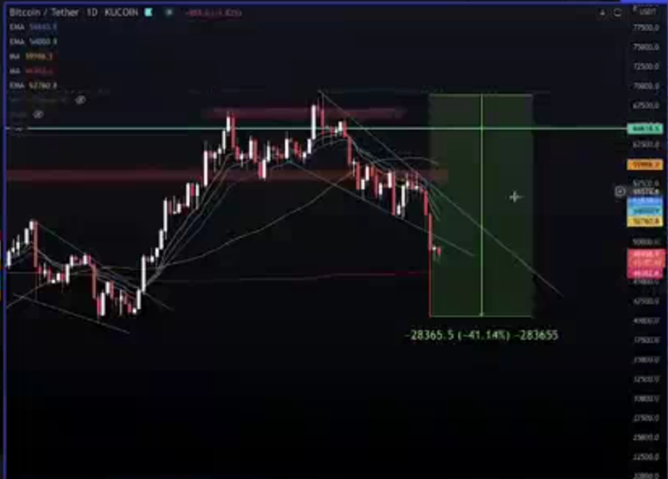

## This is Exactly HOw Bear Trends Start

* if you trade in this patter for short market trade above 50 moving average and order in 9/13/20 moving average but don't trade below that

* take the take profit in previous supply or demand zone or in place that other indicater ( crypto fear or green ) look at this indicator and make your profite on it

* example
  
