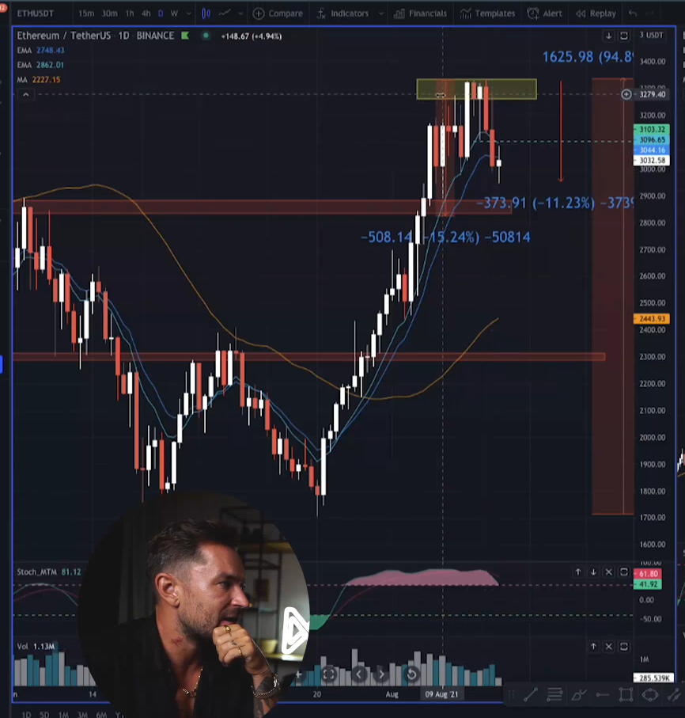
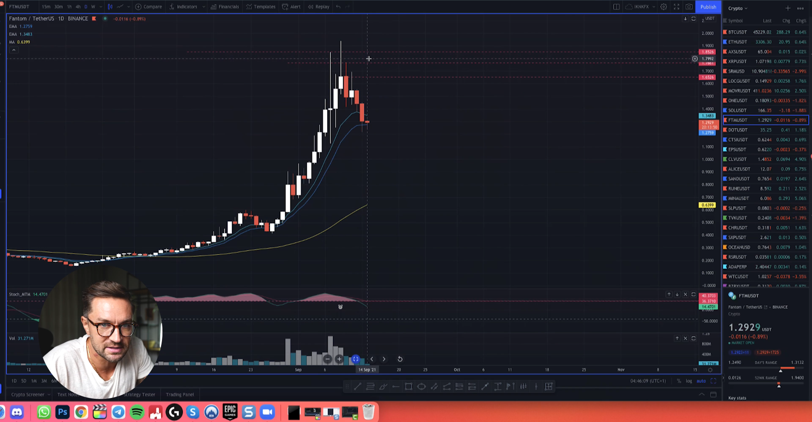

## Some Example For Real Trading

### How I Take This Trade ?

**in this trade we take trade first in low in 2.74 cent but we close it faster with less profit and we take another trade in high in this line that is red**

**why i take trade in that place because it is most likly that market go to down and i look for other chart like god of crypto it is bitcoin and ethrium this is more indicate for downside if market not indicate for down or upside you should look to other market that go with it this chart in this case it is ethrium and bitcoin**

**i also look at indicator like Stock_MTM for take my position in 15 minute for short and i wait in position to close my profit for less profit for longer profit if go down more**

### Key Point

1. look at other market in chase you have no idea in this chart that you want to trade

2. look at indicator for trade in minimum time frame

3. look at this possibility that market will go to down

* adaust

**1D**

* adaust
**15Min**

**using indicator for more info**

* bitcoin
  

--------------------------------
--------------------------------
--------------------------------

### How I Take This Trade ?

**i trade adausdt again i sell in this place that line red indicate for it i sell it becaue in bitcoin and adaust is more possiblity happen with more info with this indicator that i use and short morket is much possible than buy market in that environment**

* adaust after pull back another trade for short

* looking at daily time frame and 15min time frame and look for place for short it in market 

* looking at indicator for more possiblity in Daily and 15 minute in 15 minute the indicator is has less likly has power but be carefull when using it

* looking at bitcoin in Daily and 15 minute and look at this pull back that happen in bitconi this is more indicate that downside is possible now

--------------------------------
--------------------------------
--------------------------------

### How I Take This Trade ?

**i took this trade base on ethrium strong level for downside you can see that bzx have more squize than ethrium but both in one level have more possiblity of rdown side this is why with this strong indication and small help minimum time frame and maximum time frame and indicator i can decide for sell in right place**

* bzxusdt: you can draw line in multiple way like this way i took in picture 1 and 2 and 3, also in 4 
  picture you can see that in 15 minucte there is multiple way you can trade short in bzx 
  with help of this indicator that we have like this Stock_MT in picture 5

* ethrium: i took help of ethrium for trade short this is picture ethrium in 15 minute you can see that 
  this the right place for downside because in place of supply zone base on ethrium power i can decide 
  more storng on bzx

* bzx and ethrium in 15 minute: you can see in both of it that market pull back in supply zone to make ready 
  for downside 

* bzx in 1D and 15 minute: by hleping 15 Minute and 1 Day and both indicator in this two side you can decide 
  for downside

* ethrium in 1 Day this is more info

--------------------------------
--------------------------------
--------------------------------

### How I Take This Trade ?

**i take this trade base on bitcoin movement but market reverse then i take my loss**

* totusdt: when bitcoin is ready to downside also totusdt in 32$ is have momentam that should going down but not do that instaid it is reverse more and go to up bitcoin in other hand is go to down 

**1 Day**

**1 hour**

* totusdt: also lesson to the market it self not just big mom bitcoin this is more important that lesson to chart it self is more important that other market like bitcoin and ethrium or just take big stop loss solving that problem

* totusdt vs bitcoin: before and after bitcoin is just going down but done a lot of squize in that place this is why coin like totusdt is more to up very fast and now ready to down may be

------------------------

**totusdt before**

**totusdt after**

------------------------

**bitcoin before**

**bitcoin after**

------------------------

* bitcoin: bitcoin now is have strong momentam for downside this is why after loss you can go to market for make money but be carefull.

* totusdt taking loss in this point that stop loss get it

--------------------------------
--------------------------------
--------------------------------

### How I Take This Trade ?

**ethrium short sell because there is much possiblity in daily and 1 hour to go down more and more but the ethrium stop and may be go to downside in feature but not now, the actuall trade is bad because of less strong of downside and not bearesh patter that support for downside also not reached to best high for finish the preveous target of patter upside**

* ethrium: in 1D

* ethrium: 4 hour expectation

* feature of price ethrium

* ethrium: this level of support or resistance that make price go to up in feature

* minimum tmie frame like 15 minute expectation is more for bullish market then go out to market fast as possible
  

--------------------------------
--------------------------------
--------------------------------

### How I Take This Trade ?

**i too this trade base on bitcoin price also this market movement that ftm it self have for downside i use 15 minute time frame to find my position and enter to the market**

* ftmusdt in 1 day

* ftmusdt in 15 minute
  

* ftmusdt in 15 minute position of sell this is red line
  

* bitcoin price in 1 day

--------------------------------
--------------------------------
--------------------------------

### How I Take This Trade ?

**this trade on ocean done base on ethrium and movement of chart of ocean it self but most strong is taked by ethrium**

* oceanusdt ( 15 minute | 1 Day )

* oceanusdt and ethrium
  
**1 Day 1 Day**

**30 minute**

  
--------------------------------
--------------------------------
--------------------------------

### How I Take This Trade ?

**we take this trade base on supply and demand and bitcoin movement to down **

* oceanusdt: sell in the green line in up ( final swing )

**1D**

**15 min**

**1 D    &   15 M**

* bitcoin
  

--------------------------------
--------------------------------
--------------------------------

### How I Take This Trade ?

**rsrusdt loss and recover loss in other position this trade in position loss in bad idea in this position that rsrusdt have not have any supply or demand to buy and sell in that position for solving that we have taking idea in other chart like bitcoin but if you take this just base on other chart not other strategy this is bad idea it is just one single idea you take order base on this**

* rsrusdt

**15 M && 1 Day**

**1 Day**

**1 M: short in red line loss**

**1 M: another short in this position that gesture have on it**

**1 Day: bitcoin**

**15 M & 1 Day: bitcoin**

