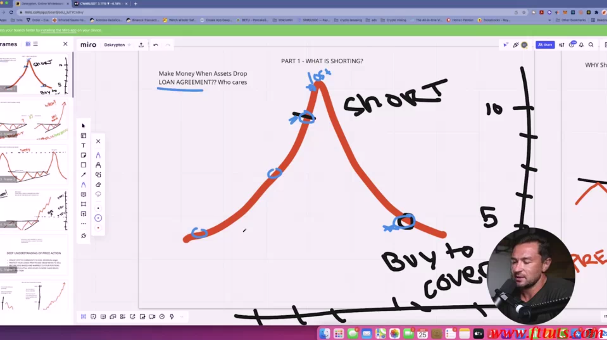
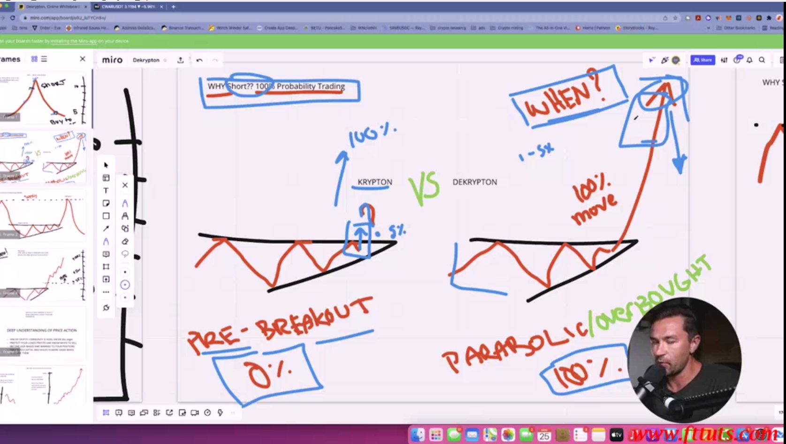
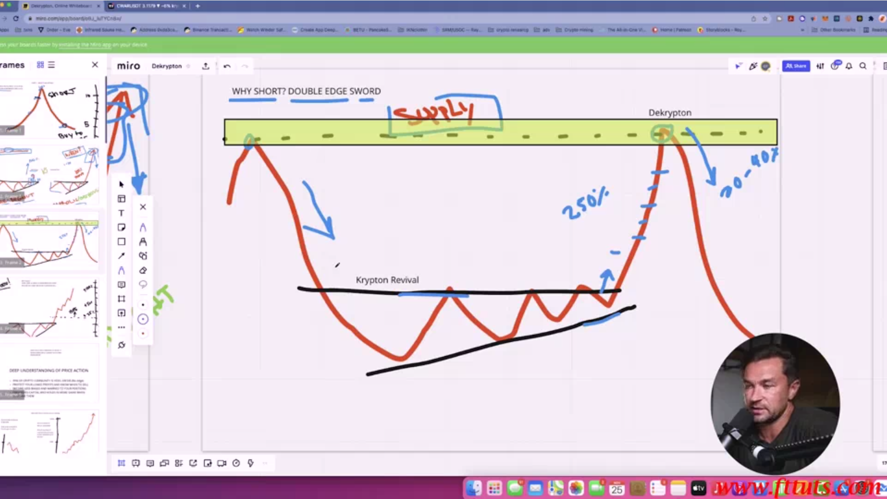
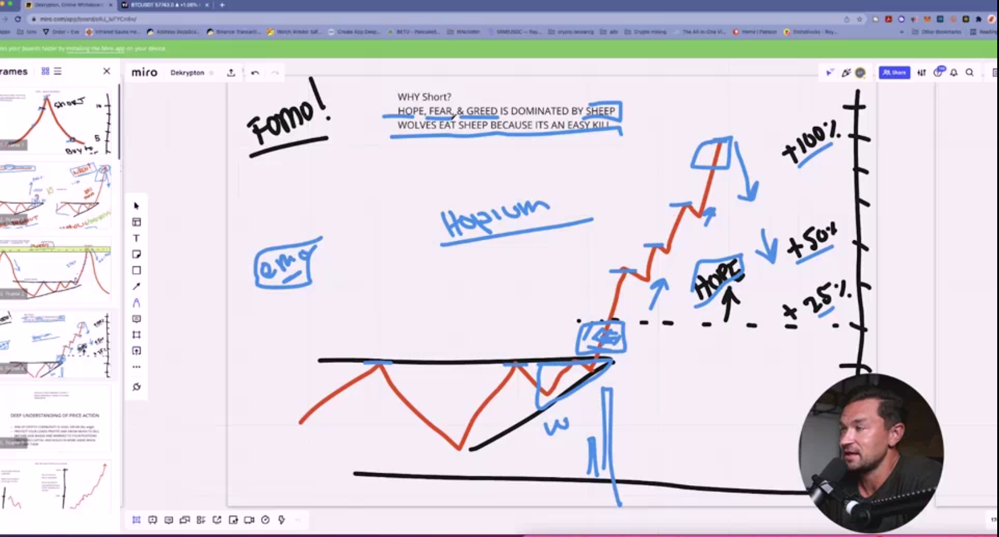

## What Is Shorting

* you can see in this picture that after any upside you have downside also and when you buy the buy can go 
%5 percent or %10 or %100 depende on the market and this psychology behind the market also technique and
fundamintal of the market

* Shorting is just abut Make money when assets drop long agreement ?? who cares

* Why short ?? because %100 percent probability trading that short come to market after big up

* there is change after patter break to upside the probability of going up is don't know anyone it can go %20 
percent after that drop or %50 percent but you should learn that when this downside is actually happen and point 
this area by using your knowledge about this area this is why after big move to upside it happen you should be 
point this area that you go with KRYPTO ( upside ) and reverse that you should detect that area that DECRYPTO 
( shorting ) come

* shorting is not magic happen in world of crypto is like normal work when you analyse the market for upside 
in this case you analyse the market for downside some people just reverse the chart and work in this environment 
for decrypt the market

* supply and demand is one of the big point we use in this market for analyse the market for downside

* Why Short ? Hope, Fear, Greed is dominated by sheep wolves eat sheep becausee it's an easy kill

* we have in the market when crypto market need go up it go like shoking go but when need dow it is down very 
less may be %30 to %10 percent but some times like crypto market today in bitcoin is %100 more but when it need 
to down it take very fast for downside but when market need go up sometimes it need 1 year or 2 year some times 
in 10 or less than 10 month in most of senario it depende on the market

* sheep is always in one point but walf always in that point that it need not with all sheep this is why most 
people is just lose but fewer people is wine this is why the crypto market not just for everyone

* DEEP UNDERSTANDING OF PRICE ACTION

* soem point you should know about price action

    - %99 of crypto community is hold or die ( no edge ) 
    - protect your longs and know when to sell 
    - become less biased and married to your positions
    - presereves captial  and holds in ore gains when you have them

* you should't be a holder this is along of deep holding this is sheep idea most of sheep person is like that 
and it is also more more of breaking psychology not be like this you shouldn't trust market because in this 
market every thing is about not trust and working in your experment with this idea that you are build it

* protect your risk management and know when to sell or buy and protect in your capital amount of money that 
you have and how to play with this money

* understand that you should not follow anything that you get in the people follow this experment that you get 
or search for it or get it with market, it is normal to see other idea people but it is not normal to not follow 
your rule in tradding

* understand that when you play with long tearm or hold your coin and when to sell this is done when you are
become more experment and understand more about this game with market