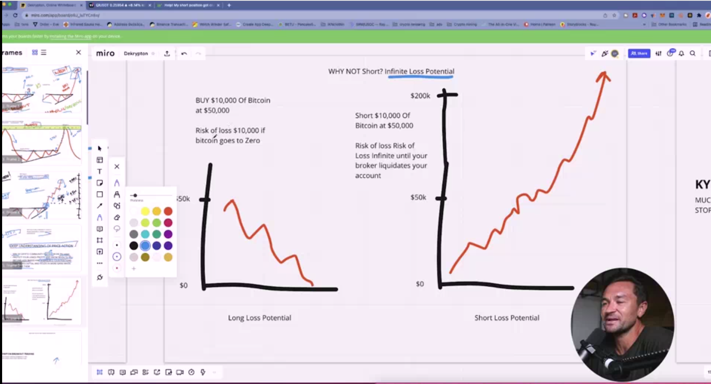
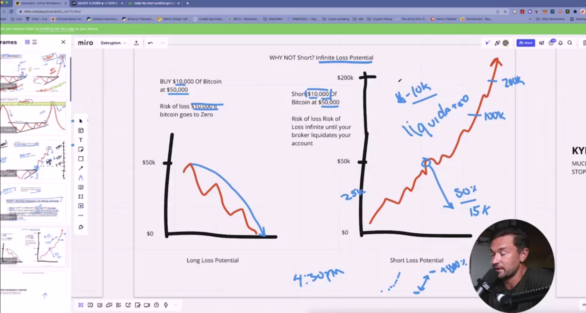
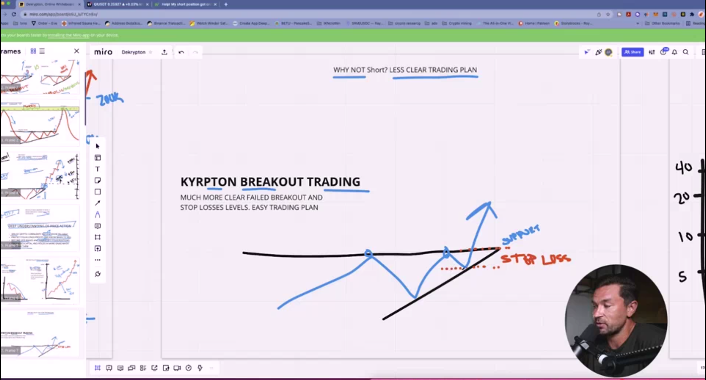
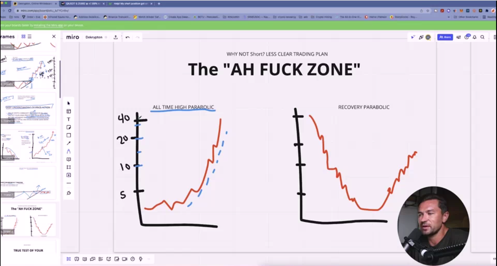
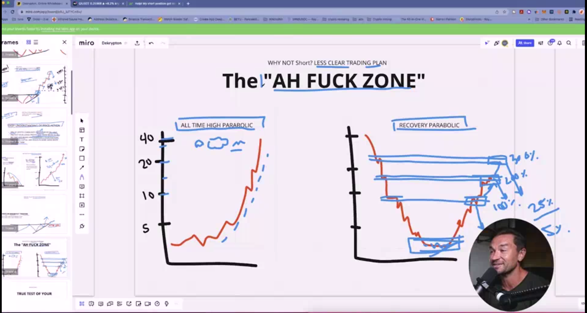

## What Are The Risks

* short position in crypto market is for pro user in the market pro user is pro user but regular 
user can do that and much better than pro user if follow the experment very carefully

* remember that shorting is higher risk and higher strease you should remember that management this 
two thing with your self is take time and make sure you should use this time very carefully and 
badly with your self

* you should be carefull what market and what broker you use with this game means when the broker allow 
for open the market and close the market mainly if you use full time market open is just better

* you should be carefull that go to up is just another game that go up very very long but down the market 
is short yes just short time for downside after that go up but when market actually want downside it is 
go downside crazy

* Why not short ? because infinity loss potential 

* So Why long ? because i long for crypto is just better than shorting crypto is game inside people that want 
upside more than downside it is less likely that crypto want downside

* NOTE: This word for downside is not true crypto today is just like normal business that upside and downside 

* NOTE: when crypto is decide go down more then go with short is just very very good idea in that time

* just fucking follow your rule

* in that image when you see upside you are know if downside happen it is more likely is fake breakout but when 
upside happen it is less likely be the fake upside breakout

* when market decide to go up it is when in beganning that you analyse the market you see that market go up and 
break your supply when go up it is not stop supply you are be godly angry but you get in the point the when you 
buy it is much better than not sell because sell is more short and profit is less but buy is more and more ..

* remember that nothing much more than better that you don't loss your time and short for the market for this 
less profile actully profile from short is not less if you combine it is more than profile from upside this is 
why downside is more profit than upside but you should be very psychology great about that idea and practic in 
the market 

* Why not short ? true test of your patience & carefull high stress & high risk

1. Bitcon

2. Ethrium

4. XRP

4. Litcoin

