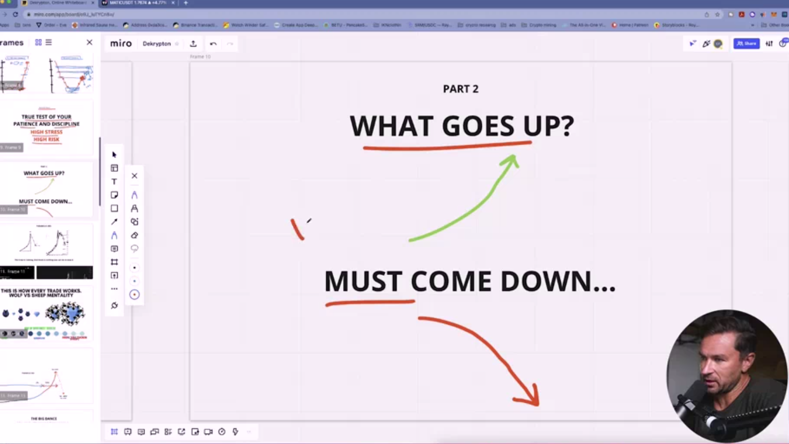
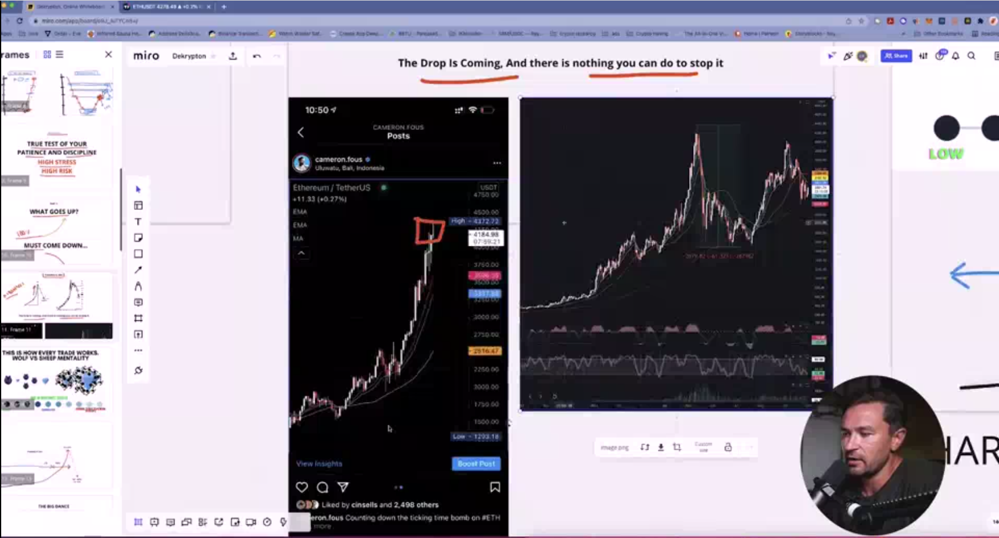
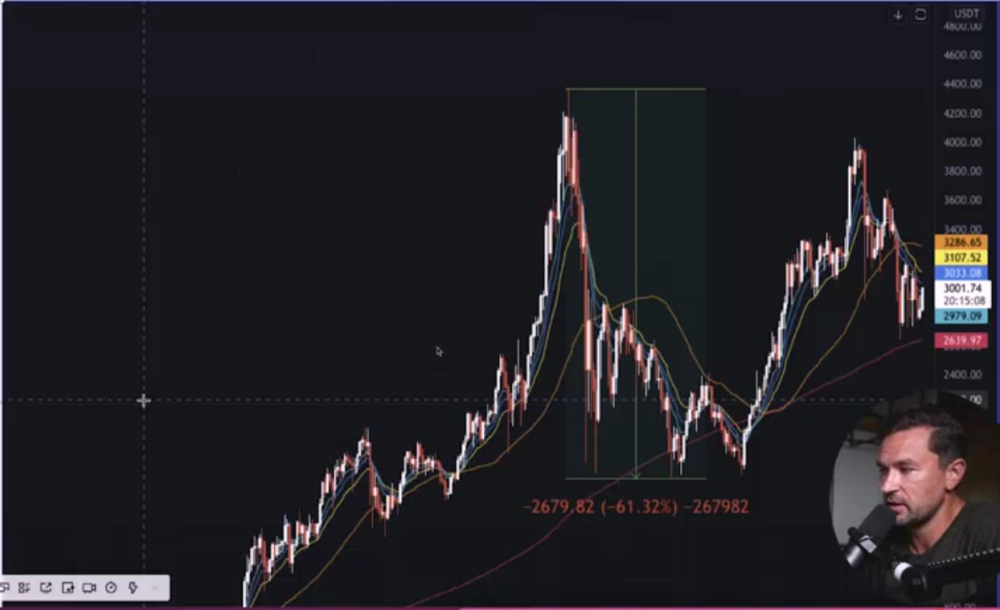
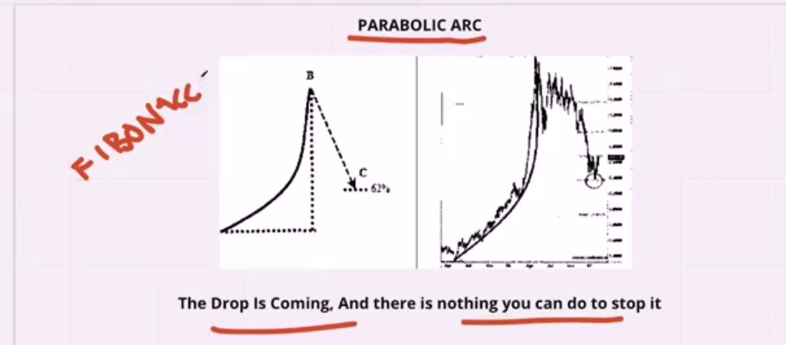
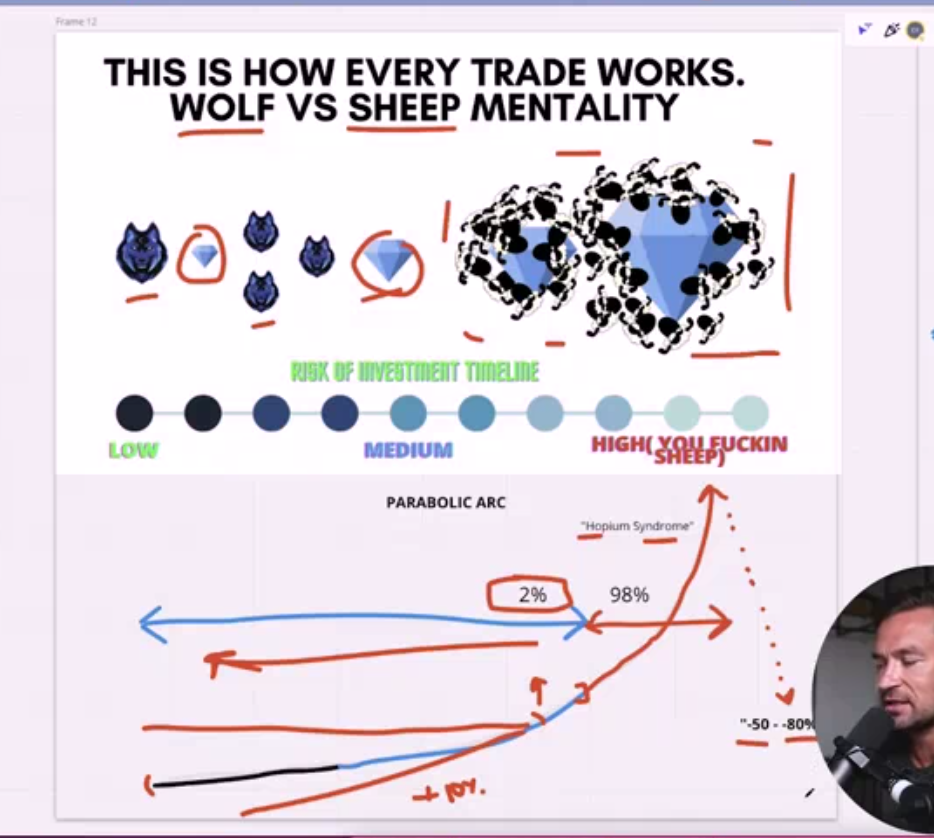
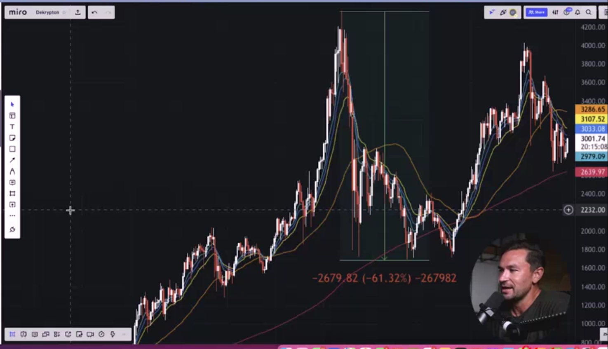

## What Goes Up Most Come Down

* after any upside is happen %100 percent

* level and techniquel analyze is work because this idea is just use and test for houndred of year and work for any trader

* if something is not work most of the time feawer people use and under test this strategy is just not work

* the wolf is not scare and follow there rule and know where to take the market and where go out

* wolf mostly not follow people follow there rule and there idea about market

