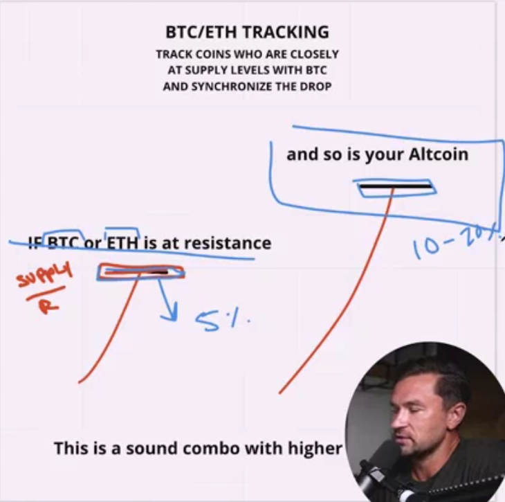

 ## The Big Dance

* all altcoin follow the ethrium and bitcoin if this two down %5 percent all coin will 
down %10 to %20 percent some times more or less this is true for upside also

* if you want buy or sell in altcoin you should first analyse the market for bitcon and 
ethrium base on this you can analyze the market for altcoin also and trade in that market

* if stock market like downjonez or s&p500 is builish then the market for bitcoin and ethrium 
also is builish

* so just follow you techniquel analyse but when you do it do it for stock market like 
downjonez and ... and for bitcoin and ethrium and decide what you should do 

* it is just not enough for analyze the market you should follow your rule that you marked for 
doing it when you analyze the market but remember that psychology is big game in the analyzing 
the market

* now looking at bitcoin

* now looking at ethrium

* now looking at altcoin like DOTUSDT

