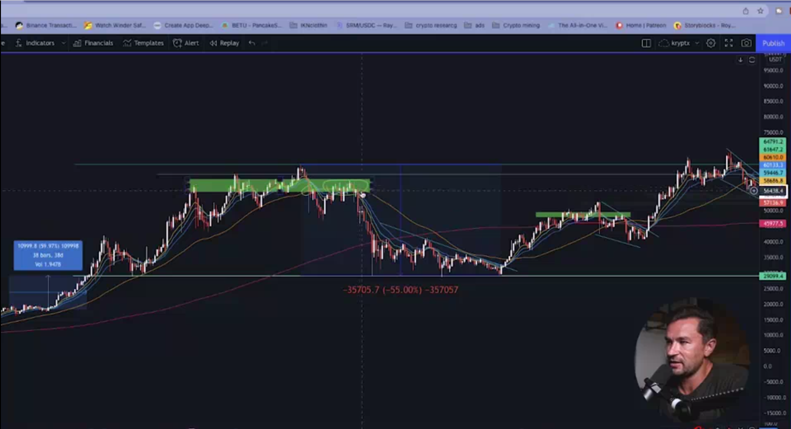

## Tops _ Bottoms Predictable

* supply and resistance

    - supply happen when price heavly react for bottom line down, and price go to up side in this line

    - resistance happen when price heavly react for top line up, and price go to down side in this line

* NOTE: the price in that level should go to up or down more affective than anywhere in the chart this is where you get the supply or resistance

* you can use 50 day moving average to identify the reverse pattern in bitcoin means price reverse

* remember that in the end of the day you should follow your rule and the techniqule analyse from this experment that you are learned from 

* for example in 1 decemeber 2021 bitcoin is just down and all altcoinn is going up this is crazy but this is happen

* bitcoin

* altcoin

* follow this rule

    - supply zones
    - demand zones
    - 50ma trends
    - 9/13/20 ema trends
    - parabolic
    - preparing for the end when long when above condition apply

