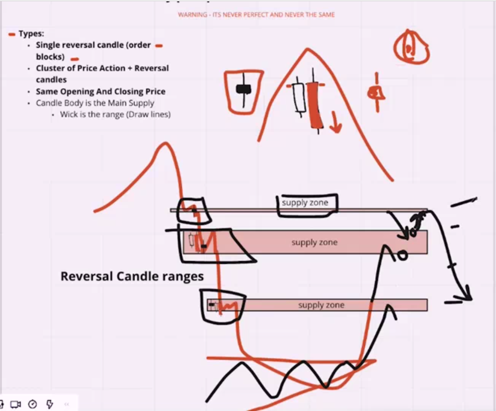
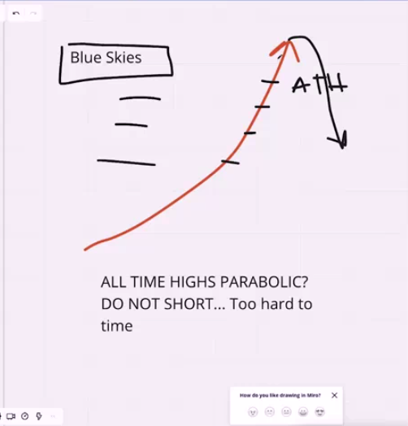
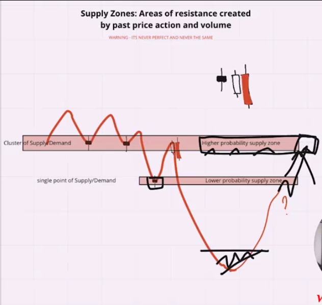
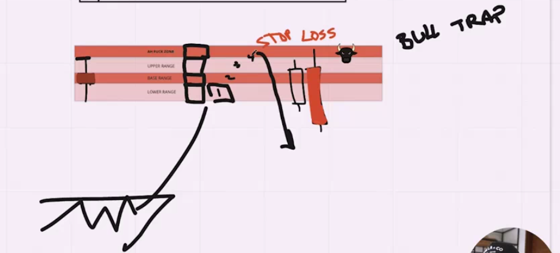
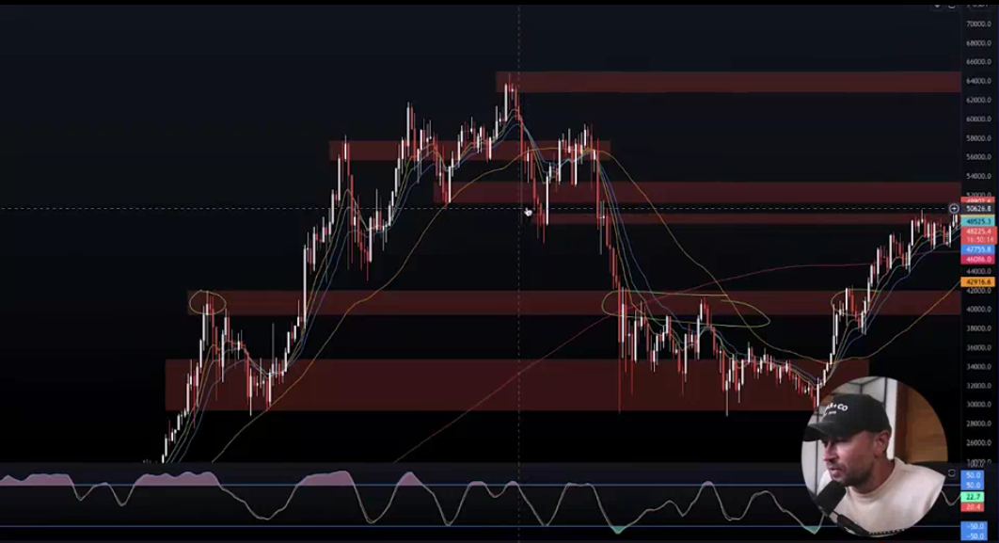
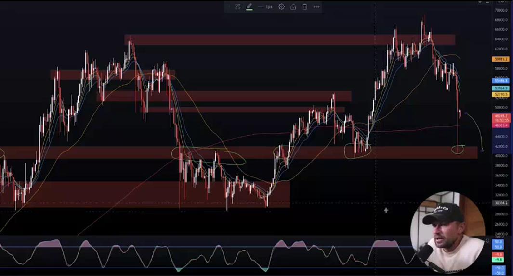

## Supply & Demand Zones

* support and resistance is something that draw in this position that trader want reverse price in that position that it want be, support and resistance is not something that is wrong for you or wrong for there it is just something draw base on your mine that you actually this draw and reversing and quality of this knowlidge just come base on your expernies and more practic and backtest.

* in this image when price is reverse it is go to up and when go to up there is some possiblity that this supply that draw price will be reverse on it but you should be aware higher your supply zone higher possiblity that price in that range will reverse.

* if you look also in this picture there is some candlestic that help you to draw supply and demand.

* if there is not data that when you should be draw supply and demand then you should trade base on your knowledge that when price actually reverse this is happen when there is some possiblity that actually in range of price is end and price is reverse.

* recommended not trade in that price movement but if you do be carefull that anytime price reverse and price may be reverse in higher range or lower range, recommended if you do that be ready for close your possition any time market reverse for up.

* this marketing strategy is like scallping

* if there is multiple resistance or support that is ready to be reverse resistance or suppot then in that range there is much more possiblity that price will be reverse in that range

* in that range may be there is another candlestic that like this white and red that indicate that the price is reverse for down, another time when price is come to this range there is higher probability that price will reverse in that range

* in that image you can see when price go to up and you draw the supply in the up there is some possiblity that when you risk %5 percent to order all %5 percent in one place do it sprately for example you can order %1 in any possiblity place that price may be reverse and when price go to up more you can order %1 again this is much less risk and much good ordering in marketing down

* some example of supply and demand

* you can see some possiblity of reversing price in supply and demand in feature but if you look closer you can see that is much tricker to decide for this price that come after previous supply or demand but when you see it in the feature it is much stronger 

