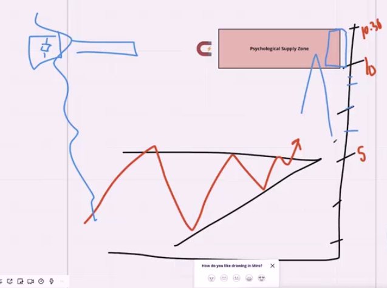

## Whole Numbers

* in that image we see that we can actually know where market down base on this price that get some time is just knowledge that just you are expect that this crypto will go down in that price but some of the marketing is just take rule for this expection like this image that after first image

    - **< $10 coins key levels ( $1-$5 and $10 )** 

    - **> $10 coins key levels ( $10, $20, $30, $40, $50, etc.. )**

    - **> $50 coins key levels ( $100, $200, $300, etc.. )**

* example

* sandbox 

