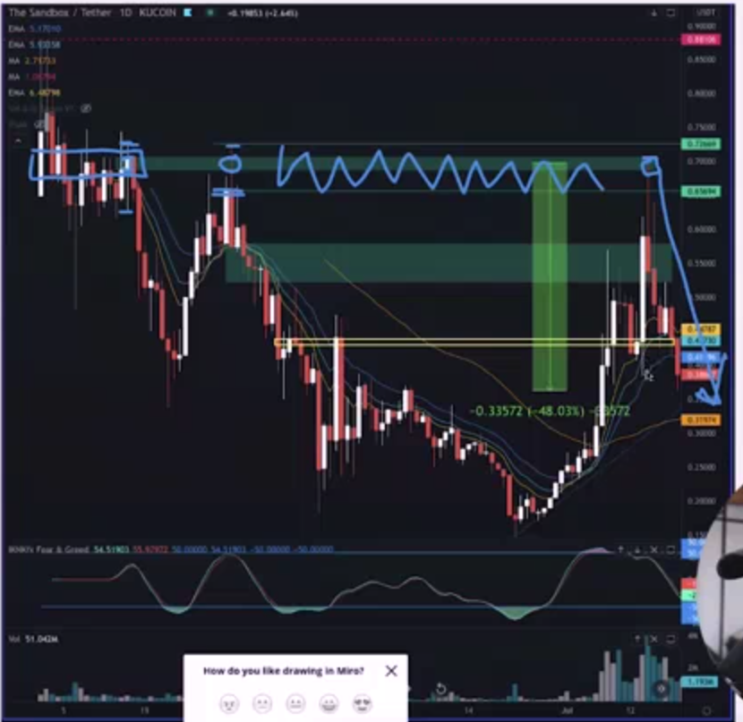

## Bull or Bear How do we know

* if price break 9/13/20 ema for upside then this is bull 

* if price break 9/13/20 ema for downside then this is bear

* example

* lesson help you in the feature trade

* this trade is come in two place with each other but ferst not break to downside but other yes 

