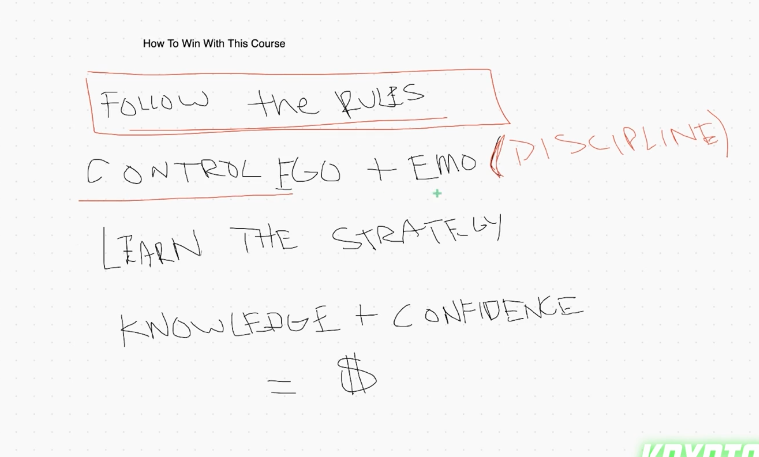
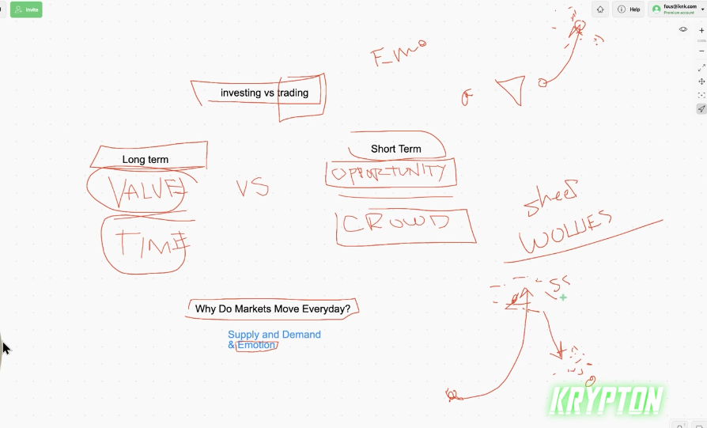
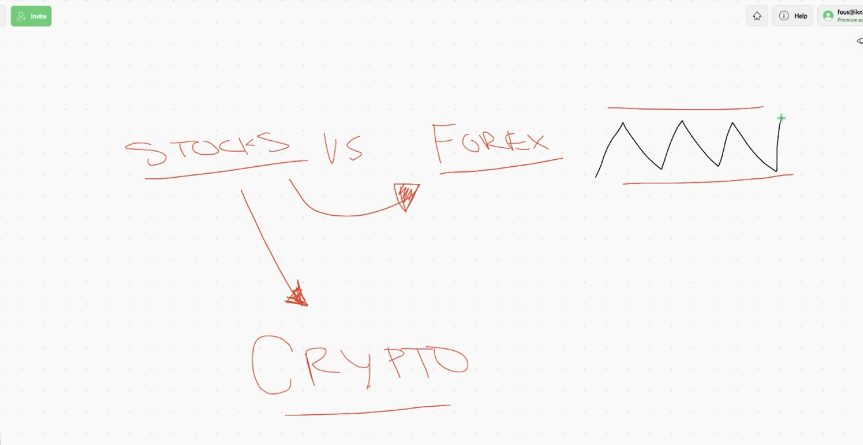

## How to become a wolf with krypton

* this course is very speed and efficent and we don't have power point

### How to win with this course

1. follow the rules that you done with your expernies and this knowledge that you get frome anyone like this course
   
2. ( control ego + emothing ) this is the larger point to be stable in this market control your ego and emothing don't be like someone that thing i am god because you just fucking win some trade or some trade that win large money

3. ( learn the strategy ) don't learn just this knowledge that you get from this course or any outside info in outside this course learn from your expernies and this strategy and rule that you write for your self in your hand or in your mine

4. ( knowledge + confidence ) be conftable with this knowledge that you get with this course or this knowledge that you get from outside this course but this knowlege should have great rating and great review to decide to learn it

### investing vs trading

* investing is for long tearm is about this value that asset have and how much time you should wait for it this time may be 1 month or 1 year or ....

* trading is for short term is about oppotunity and grows of this capital amount of money that you are in account is like job day by day.

* why markets move everyday ? because of supply & demand & emotion

* TB: don't be sheep be wolues to find demond and take this point to trade in the market
  
* TB: both investing and trading can be short term and long term most learning process and strategy is depending on this point that you are conftable with it.

* stock is move with stock and forex when move like index dollar the crypto also is move but movement in forex is different from stock and crypto most of forex market is just side way means just go down and up

* why is crypto such a massive oppotunity ? because crypto is for wolues not for sheep %90 percent of sheep is just loss

