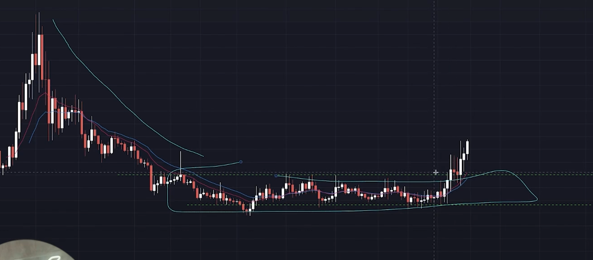
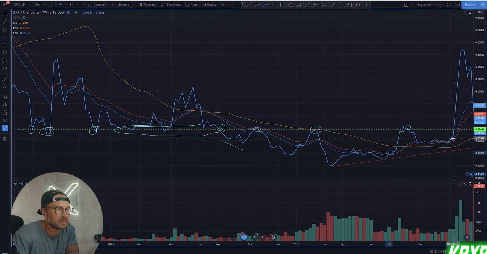

## How to trade krypton patterns - revival

* KRYPTON revival breakout

    - Criteria
      - Lead-in Trend - Bearish Breakout Formation - Triangle Or Range Breakout
      - Krypton Patterns Happen on All Time Frames
    
    - Idea Entry
      - When you see increasing volume leading into the breakout point after at leat 2x resitance have been formed
      - Look At Higer time frames for the overall pattern look at intraday time frames for precise entries ( 4h, 1h, 15m )
      - IDEAL EXIT
      - Near whole  #'s Or Previous consolidation flags in the former the trned that had heavier volume and sideways price action

* My thought 

1. website
   
<a href="https://goodcrypto.app/chart-patterns-for-crypto-trading-trading-patterns-explained/">top best pattern for crypto</a>

### if this website is broken then go to images folder and find file ( chart_pattern.html ) double click on it you will get the cloning website

2. Theory

* first you just need find this pattern not matter if it is in any time frames
* use line chart or candlestick way of movement market to find it
* take entry in this place that before market move to the up side like wolf not ship
* target is in the one of the demand or supply zone
* also for stop loss take it below or above for some pip in supply or demand zone
* end

* Theory
  

* Example

1.

2.

