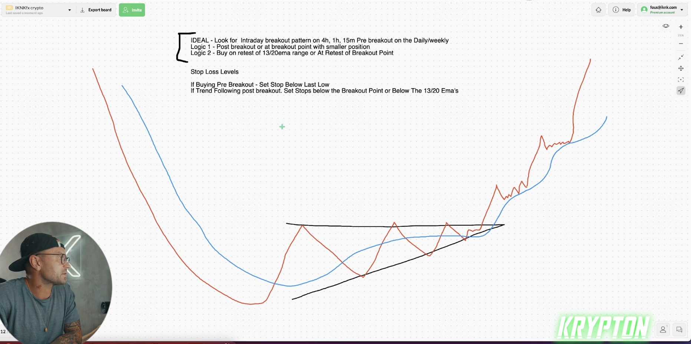
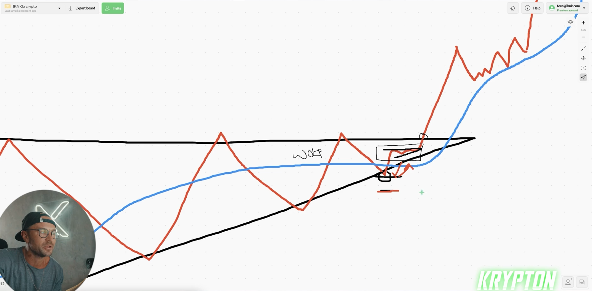
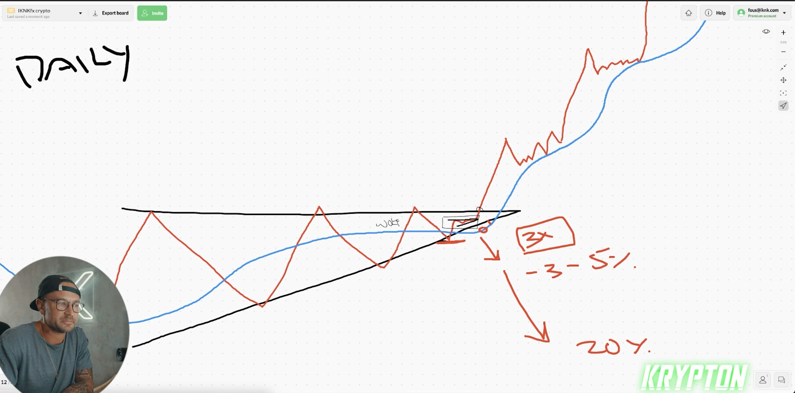
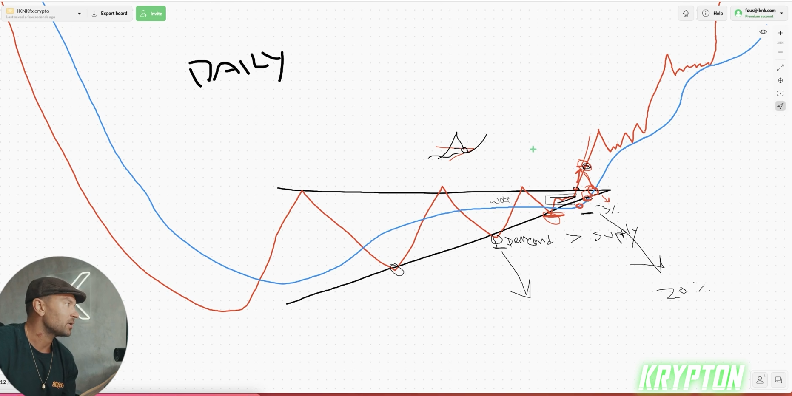
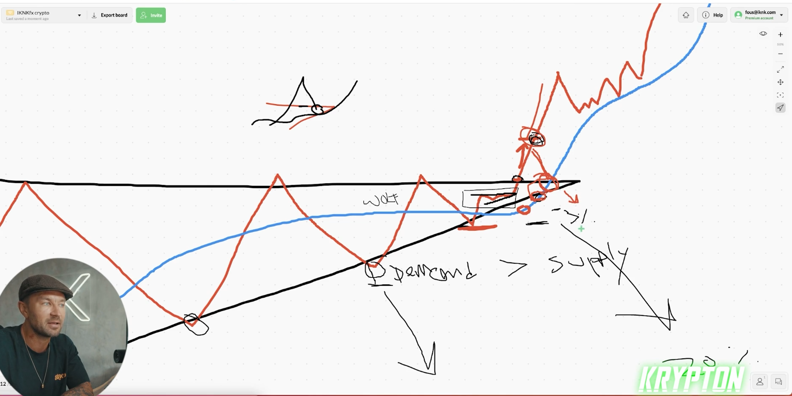
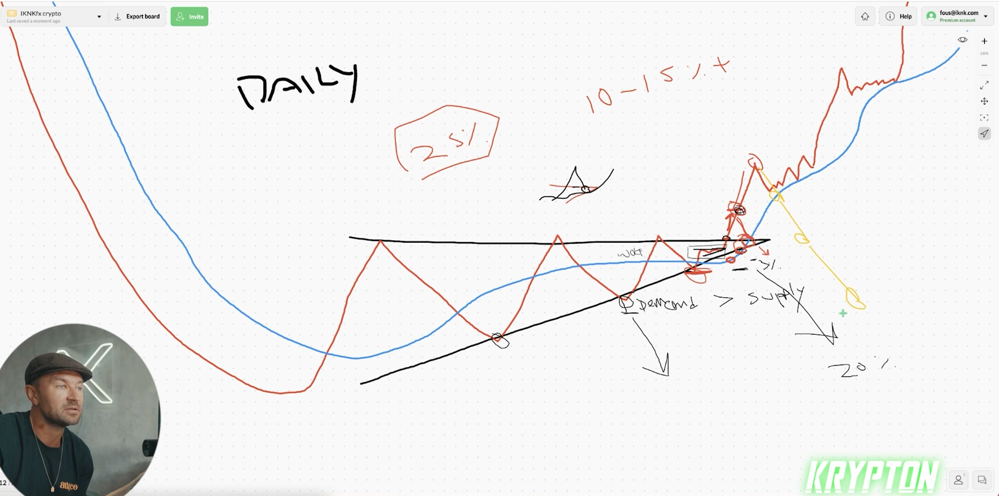
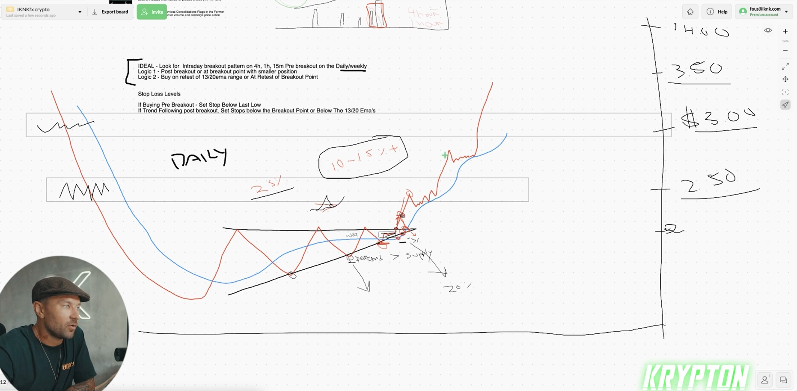
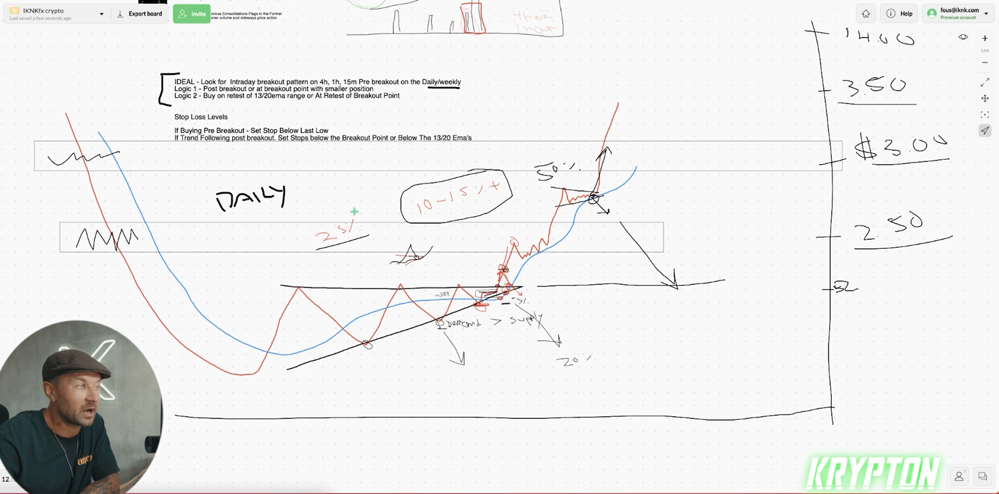
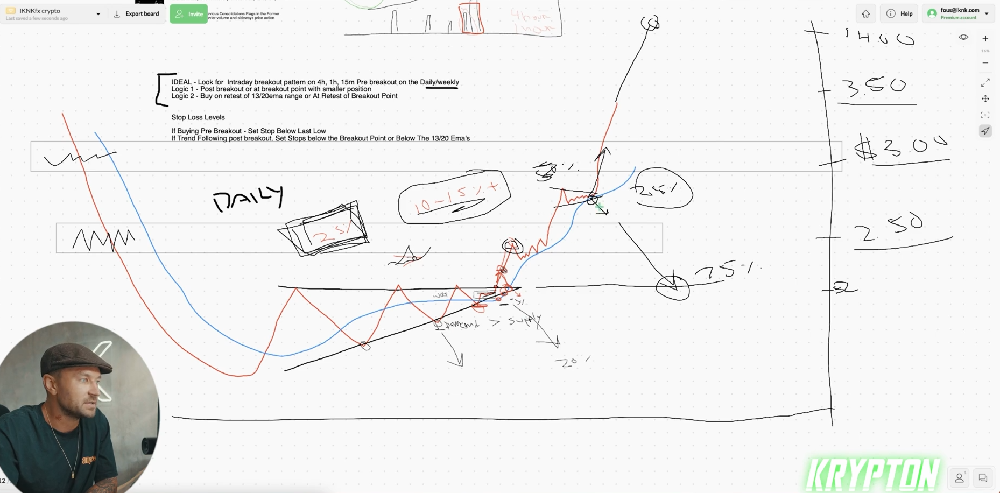

## How to set stop losses and risk management ideology

* how to ideantitfy the revivle pattern
  
  * IDEAL - Look for interaday breakout pattern on **4h, 1h, 15m Pre breakout on the daily/weekly**
  * Logic 1 - Postbreakout or at breakout point with **smaller position**
  * Logic 2 - **Buy on retest of 13/20 em range or At retest of breakout point**
  
------------------------

* **Stop Loss levels**
  
  * If Buying pre breakout - set **stop below last low**
  * if trend following post breakout set **stop below the breakout point or below the 13/20 ema's** 

------------------------

* revivle pattern

* wolf should trade inside revivel pattern and find other pattern inside this  revivel patten to find trade on it and stop loss in below or above other area of supply or demand or 30/20 moving average

* stop loss should be less not big

* some time price retest for the revivle pattern some times this is reverse the pattern fro solving that you should move stop loss to breakout or find this way that this retest want to finish it in where and accept lossing in thtat range or not loss
  

* locking 25% of profile when price move 10% or 15% percent because no one no how much it is go, so it is idealy good for your self to looking good amount before price reverse  suddenly

*  locking profite in supply or demand

* locking 25% percent step by step in the end you are trade safety for your money and  this trade that you take

