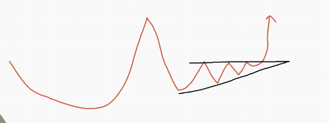
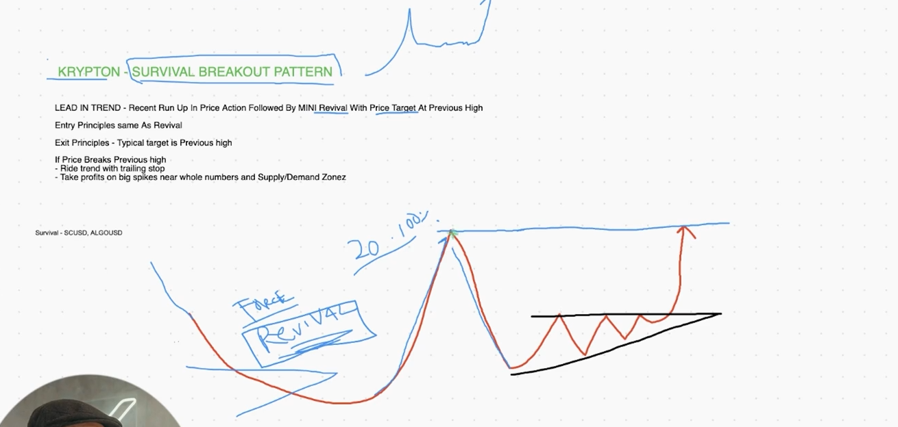
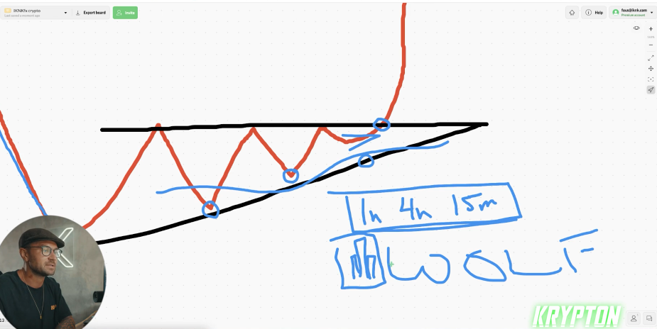
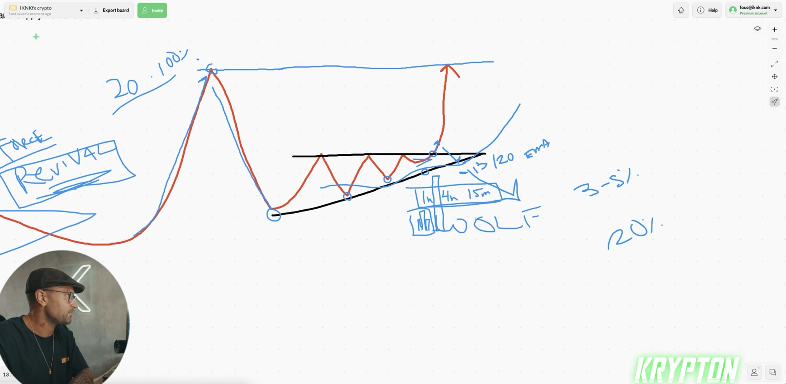
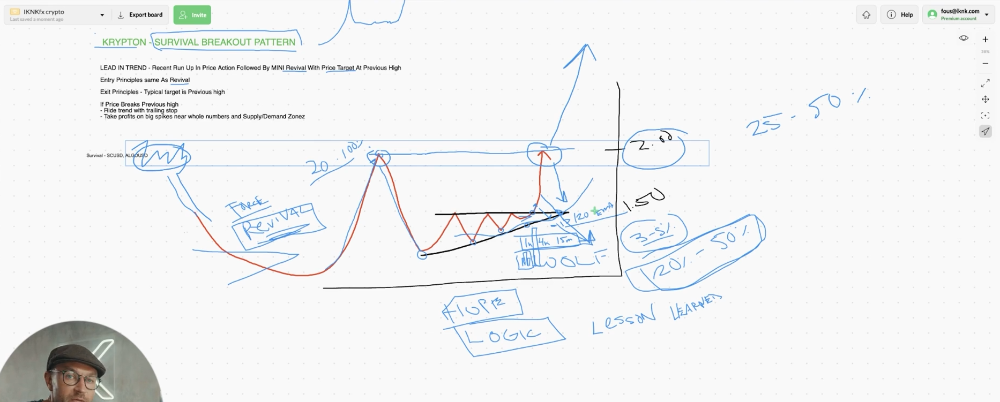
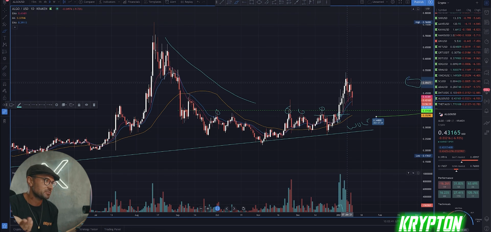
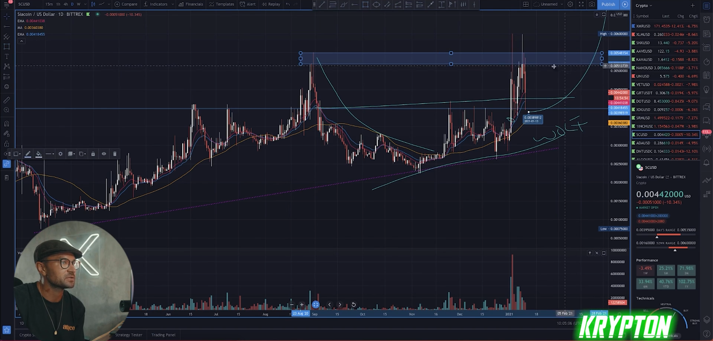
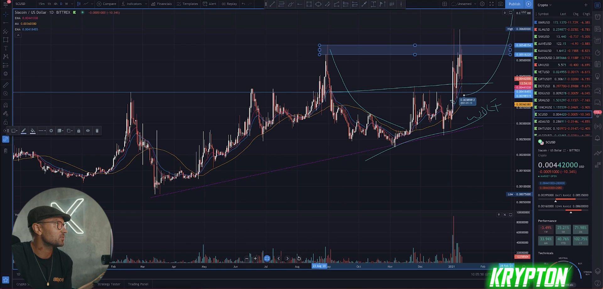

## How to trade the krypton survival

* KRYPTON - SURVIVAL BREAKOUT PATTERN

  * Lead in trend - recent run up in price action followed by mini revival with price target at previous high 
  * Entry principles same as revival
  * Exit pricnciples - Typical target is previous high
  * **If price Breaks preivous high**
    * ride trend with tralling stop
    * take profits on big spikes near whole numbers and supply/demand zones

* survival breakout pattern
  

* stop loss should be in previous high or in supply and demand this will be better in supply and demand

* entry should be inside the survival breakout pattern you can find other pattern like this close triangle or you entr in below this price that above the 30/20 ema

* when  price go up or before price crash to up side you can see in volume that price is ready it self to move up

* the target can be in supply or demand zone 

* lock your profite in every %20 or %50 percent for more safety trade like previous lesson

* lock your profite step by step when price get the targe you can lock all your profite or %50 percent of profite and lock your stop loss in good position if you plane to move this price more than you are thing
  
* stop loss should be less not big

* example

