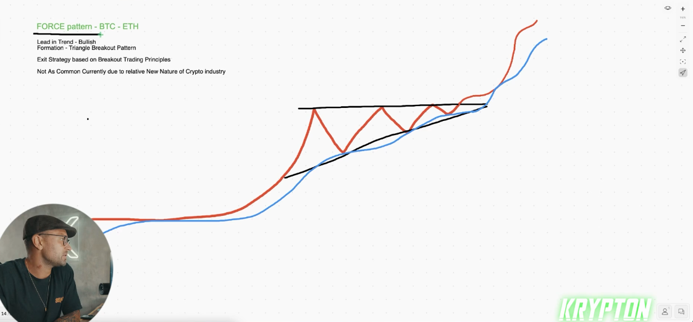
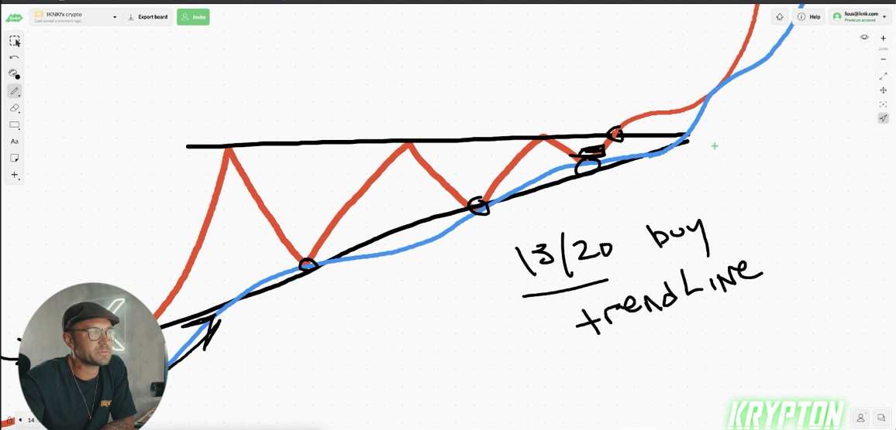
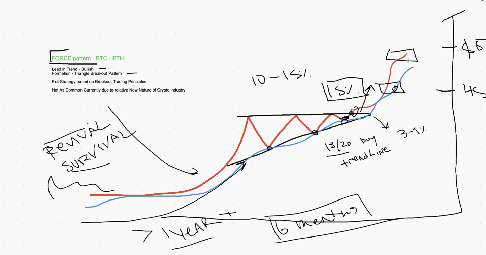
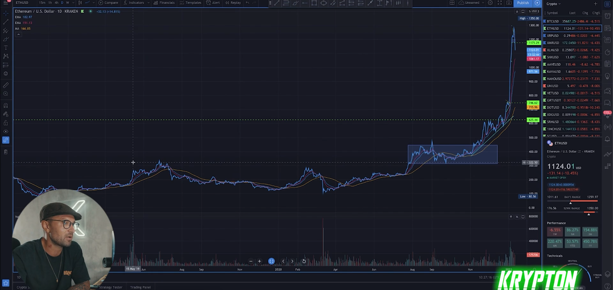
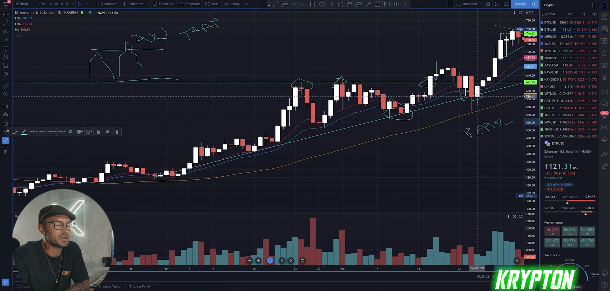

## How to trade the krypton force pattern

* force pattern BTC - ETH

* order should be in below of 13/20 ema

* locking profite and take profite and stop loss like this lesson that previously learn 

* take profite dependent on rule of pattern how much take to upside the pattern this leg should end the other side of pattern

* example
  

