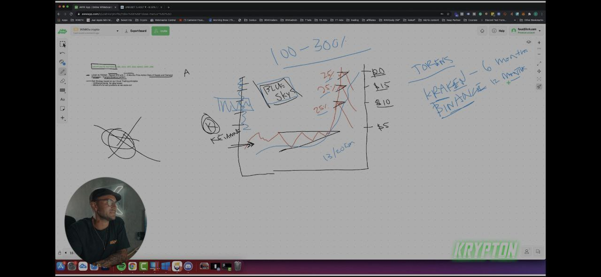

## The Krypton Pattern

* In this pattern there is no data to know the target of the price or you can do another way for solving that problem you can use psychology 
  number or use differet exchange to predict the tareget price of this pattern

* Also you can use fibonace tools to now target of this pattern

* This pattern happen in that crypto that have no data in past because it is new

* Theory
  

* Example
* 

