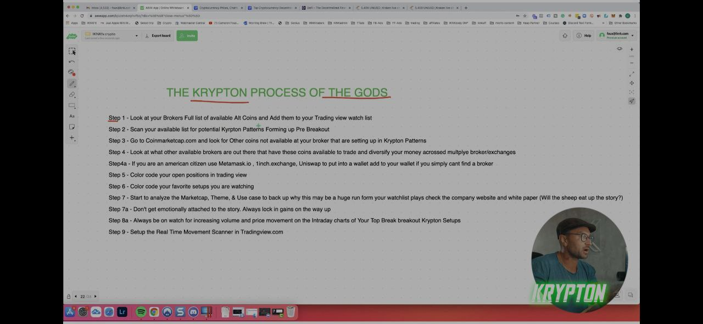
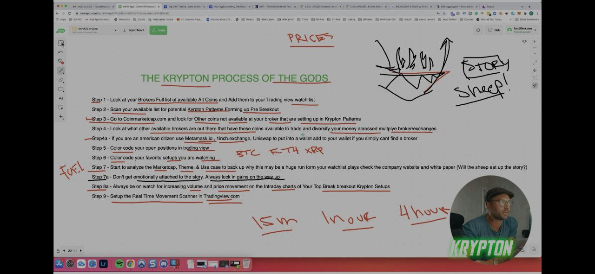
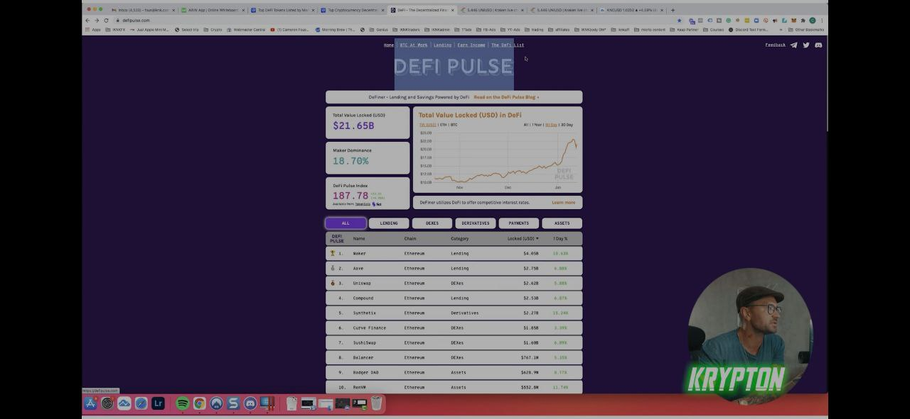
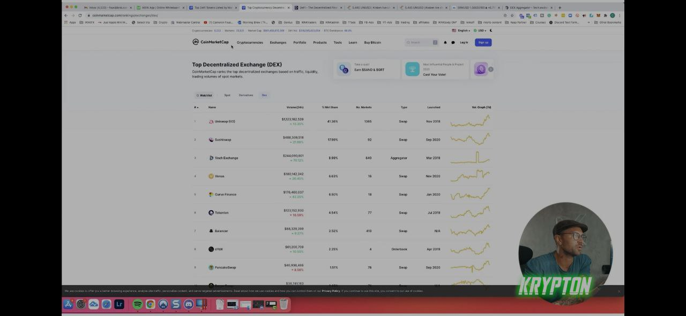
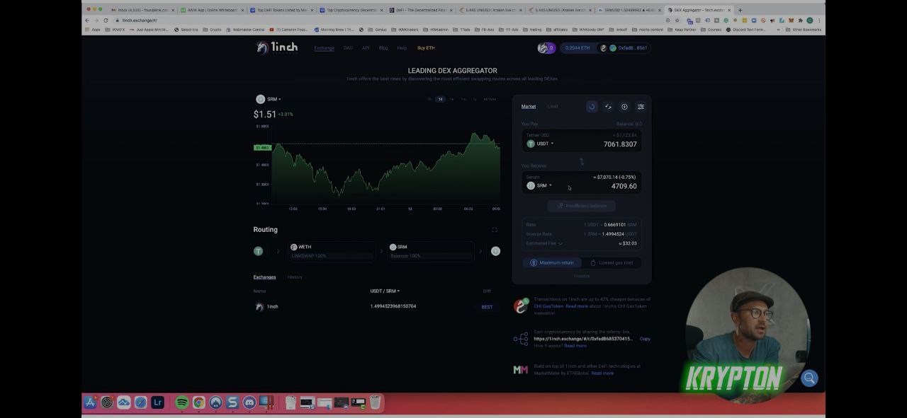
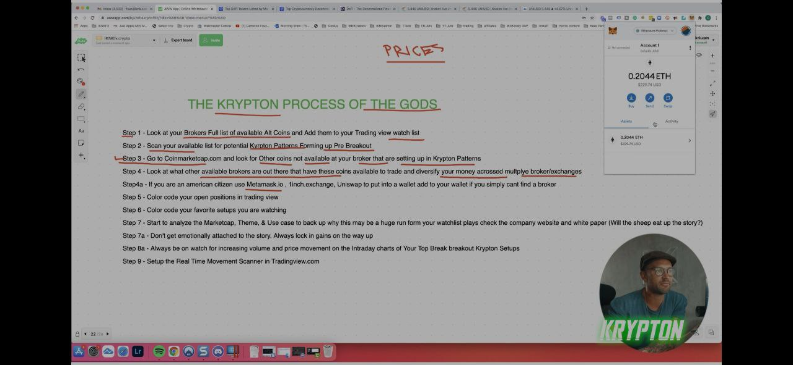

## Your Opinion Doesn_t Mean Shit

* step 1 - Look at your brokers full list of available at coins and add them to your trading view watch list

* step 2 -Scan your available list for potential krypton patterns forming up pre breakout

* step 3 - Go to coinmarketcap.comand look for other coins not available at your broker that are setting up in krypton patterns

* step 4 - look at what other available brokers are out there that have these coins available to trade and divesify your money acrossed multiplye broker/exchanges

* step 4a - If you are an american citizen use metamask.io, 1inch.exchange, uniswap to put into a wallet add to your wallet if you simply can't find a broker

* step 5 - Color code your open positions in tradingview

* step 6 - Color code your favorite setups you are watching

* step 7 - Start to analyze the marketcap, theme, & use case to back up why this may be a huge run form your watchlist plays check the company website and white paper ( will the sheep eat uup the story ? )

* step 8 - Don't get emotionally attached to the story, always lock in gains on the way up

* step 8a - Always be on watch for increasing voluem and price movement on the intraday charts of your top break breaout krypton setup

* step 9 - Setup the real time movement scanner in tradingview.com

### Theory

* some resource may help you

1. defi pulse ( https://www.defipulse.com/ )

2. coinmarketcap ( https://coinmarketcap.com/ )

3. 1inch ( https://1inch.io/ )

4. metamast ( https://metamask.io/ )

