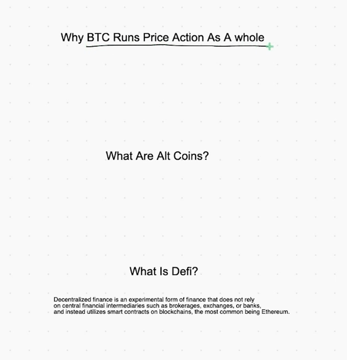

## Why bitcoin rules the world but altcoins is where we trade

### bitcoin the king of price action

* basicly when you want trade in crypto you should first of every thing shoud look at bitcoin if bitcoin go up every market of crypto is go up when go down every market of crypto go down means it is indication for sell and buy in right place

* also when bitcoin go up stock market is move for upside and vice versa is true 

* remember that when trade crypto you are trade altcoin means you don't need every time trade in bitcoin you should basicly trade altcoin this is more safety and more profit than bitcoin it self

* if bitcoin go down like 10% percent altcon is down 50% or may be 70% percent some times more some times less

* WHAT IS DFI ? Decentrialized finance is an experimential form of finance that does not rely on central financial intermediaries such as brokerages, exchanges or banks and instead utilized smart contracts on blockchains the most common being is Ethrium.

* DFI is bason on ETH ( ethrium ) technology

* DFI is destrantrlize exchange means you don't need wallet or blockchain or brocker or exchange or bank to have token in your wallet you just using DFI to trade this coin means you just need ethrium smart contract and ethrium gas for this transaction may be take you more money but it is the case it is take you more token
  
* you can trade a lot of coin for example in cracken but using DFI desentrilize exchange for example 1 inch (1inch.exchange) and srm you are using something like 1 inch to purchase more token that is may be not in this platform that you are using now
