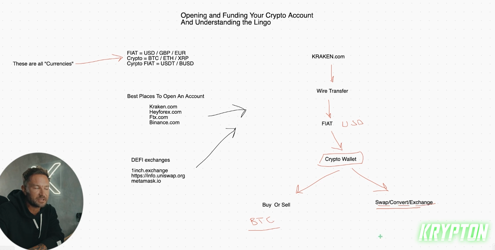

## How to open up a crypto broker and wallet to trade

* FIAT is can be crypto or moneyit self like usd and gbp and eur and .... or can be crypto like btc and eth and ... but you can use crypto fiat to stable coin like usdt and busd ( TB: BUSD is stable coin for binance )

* the most famous broker in the us
  - kraken.com
  - heyforex.com
  
* outside us
  - ftx.com
  - binance.com  

* you can use dfi for buy this crypto that is not available in your broker dfi like
  -  1inch.exchange
  -  https://info.uniswap.org
  -  metamask.io

* to use your money to buy crypto or sell it for example

    - kraken.com --> wire transfer --> fiat --> crypto wallet --> ( buy or sell ) or ( swap/convert/exchange ( use to exchange crypto to another crypto ))

* don't use laverage use it if you want free cache means make more money but use less laverage like 3:1

* some times your broker not allow you use laverage for certain coin

