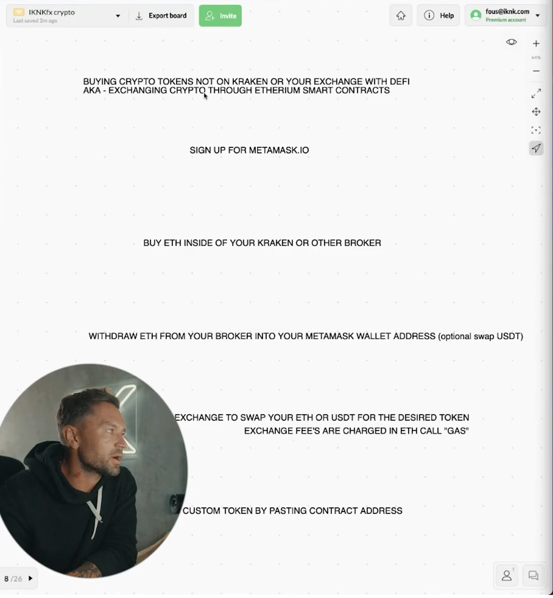

## How to buy tokens that are not on your exchange with defi

* using dfi exchange like meta mast for buy this token (coin) that not available in your wallet.

* how to do that ?
  - signup for ( metamast.io ) and download it remember it is just google chrome extension
  - after that if you want buy 1inch for example because may be you are bullish for 1inch, then you should go to your broker and click to ethrium and buy ethrium after that click to withdraw, and add your address for this addres you should after that go to meta mast and click to buy ethrium and copy the address and past the address, and after that ask you for email verification, after that it ask you how much you want withdraw after withdraw the ethrium you can optionaly convert it to usdt this is very good for this people that bearesh for ethrium and it can store stable coin without any problem, or you can just swap it to 1inch, convert this ethrium to this crypto that you want in this case is 1inch

* remember that you should have ethrium to convert your token means it is gas fee

