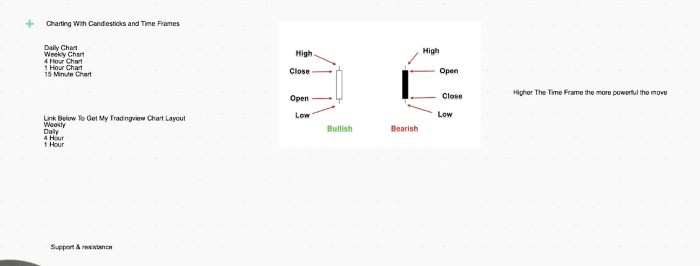
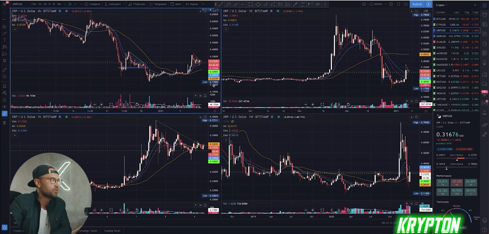

## Technical analysis basics and opening tradingview charting account

* first of every thing you should have chart to analyse it and you should use this time frame for analyse the chart and find pattern and decide base on capital money you have and this time frame that you want to target your goal 

* top time frame you should use
  * Weekly
  * Daily
  * 4 hour
  * 1 hour
  * 15 min

* for daily use just use this time frame
  * Weekly
  * Daily
  * 4 hour
  * 1 hour

* example

