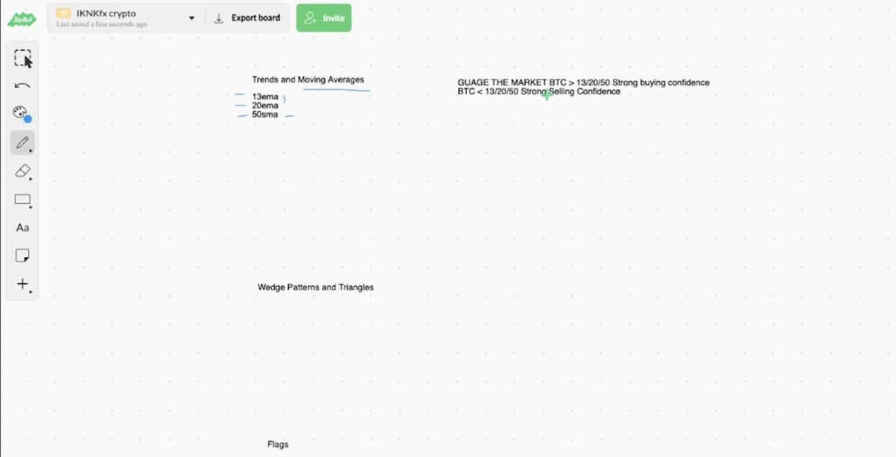
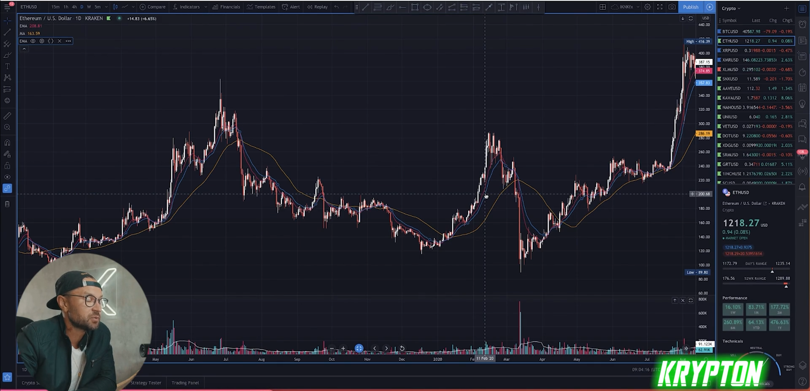

## Trends Moving Averages that acually matter work

* moving average ( smiple )
  * change length to ( 50 )
  
* moving average expontial ( ema )
  * change length to ( 30 )
  * change length to ( 20 )

* if btc > 13/20/50 strong buying confidence
* if btc < 13/20/50 strong selling confidence

* example
  

