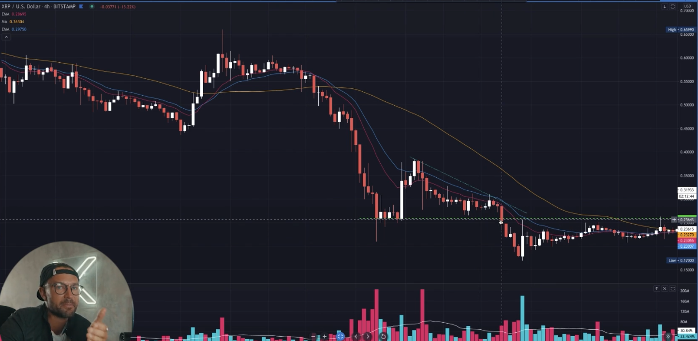

## The general chart patterns theory explained

* with pattern we look at indicator and most famouse is liquitedy and volume

* price for decide that if this crypto in this range go to down or not most price targe
  * 1 $
  * 5 $
  * 10 $

* paralel means that in small range crypto just crash in upside means pump to upside base on some knowledge but you don't know where is come down but %99.9 percent of time it is going to down example
  

* all this pattern below is happen mostly in 30/20 ema and it can be draw in any time frame but remember always draw pattern inside pattern but logicaly not not logicaly and complex just use simple way and more depth of this simplisity

* some pattern 
  

* example
  

* some pattern 

* example
  

