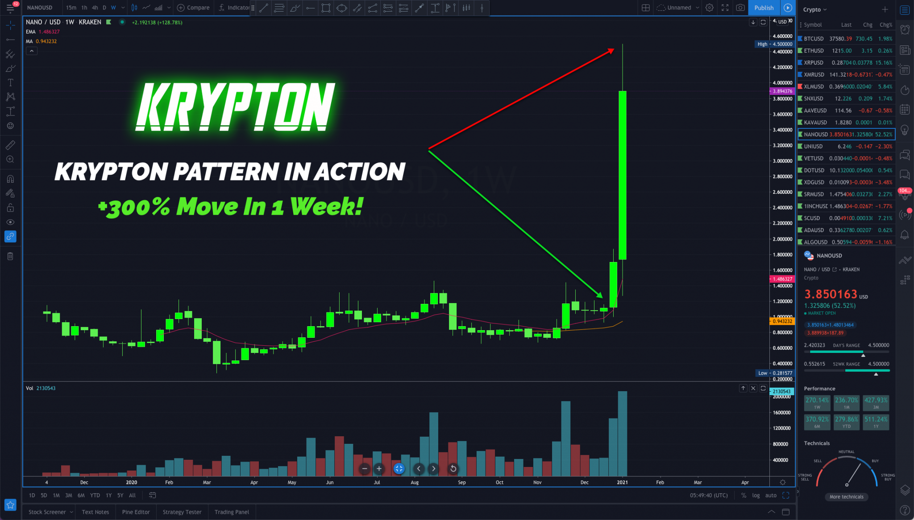

<h1>Cameron Fous – KRYPTON</h1>

### Table of content

* Part 1: Introduction

* Part 2: Keep It Simple

* Part 3: Krypton Patterns

* Part 4: How To Find Opportunities

* Part 5: Live Trades

* Part 6: Psycho Trading

### Course Video
  
  - Link [Google Drive](https://drive.google.com/file/d/1sXAw7UvtP42M81Tk3o84bXEZpGs0oEoL/view?usp=sharing)

### Why you need this course as developer ?

* for making trading bot or crypto bot
